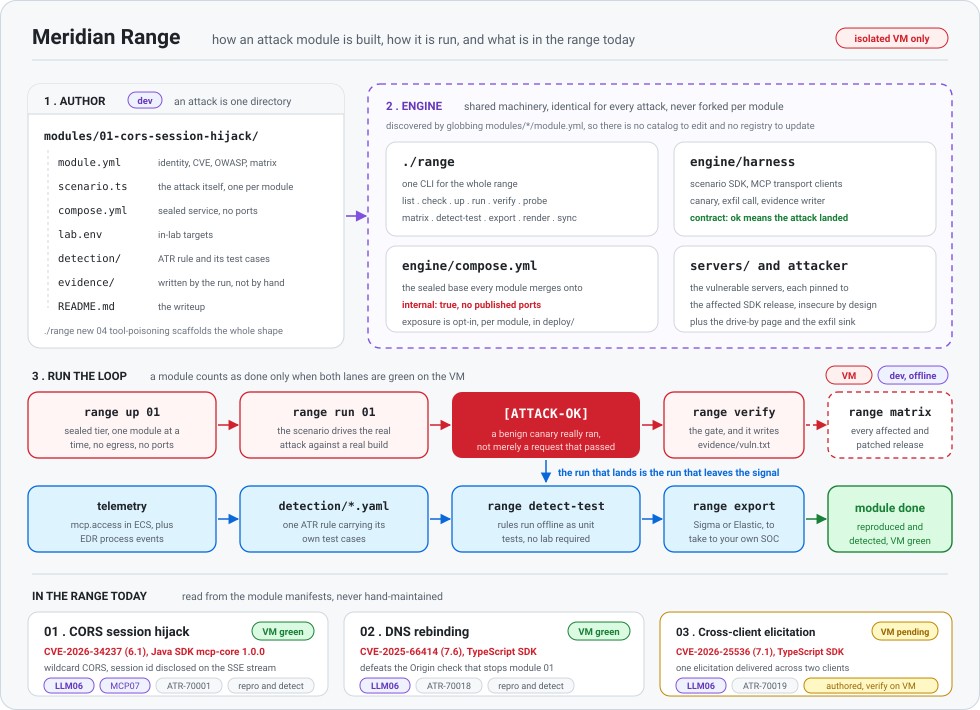

<div align="center">


# Meridian Range

**A small defensive lab for learning how MCP attacks happen and how to catch them.**

Meridian Range recreates published MCP flaws inside an isolated VM. Every attack ends with a tested
detection, not just a successful exploit.


[](./LICENSE)

[Attacks](#attacks-in-the-range) · [How it works](#how-it-works) · [Quick start](#quick-start) · [Safety](#safety)

</div>

## Why this exists

A security advisory tells you what broke. It rarely shows what the same attack looks like in your
logs. Meridian Range connects those two pieces.

Each module answers three practical questions:

1. Can the published flaw really be reproduced?
2. What telemetry does it leave behind?
3. Can a defender reliably detect it?

> **A module is complete only when the reproduction and its detection both work.**

## How it works

<p align="center"></p>

Each module keeps its scenario, detection rule, evidence, and writeup in one directory. The shared
`./range` command discovers those modules and runs the same safe workflow for each one.

## Attacks in the range

The table is generated from each module's manifest. CVSS is shown for the published CVE that anchors
the module.

<!-- BEGIN GENERATED: catalog-table (generated from modules/*/module.yml by `range render`; do not edit by hand) -->
| # | Attack | OWASP | Anchor CVE (CVSS) | Repro | Detect | Blog |
|---|--------|:-----:|-------------------|:-----:|:------:|:----:|
| 01 | [CORS Session Hijack](./modules/01-cors-session-hijack/) | **LLM06** | CVE-2026-34237 (6.1) | ✅ | ✅ | _soon_ |
| 02 | [DNS Rebinding](./modules/02-dns-rebind/) | **LLM06** | CVE-2025-66414 (7.6) | ✅ | ✅ | _soon_ |
| 03 | [Cross-Client Elicitation Hijack](./modules/03-cross-client-elicitation-hijack/) | **LLM06** | CVE-2026-25536 (7.1) | 🧪 | ✅ | _soon_ |
<!-- END GENERATED: catalog-table -->

**Legend:** ✅ verified on the lab VM · 🧪 built and detection-tested, pending VM verification.

In plain language:

- **01, CORS session hijack:** a web page reaches a local MCP server, takes its session, and invokes a
  tool.
- **02, DNS rebinding:** an attacker's hostname changes where it points, turning the same browser tab
  into a same-origin path to the local MCP server.
- **03, cross-client elicitation hijack:** (verify) one user's request can make an approval prompt
  appear in another user's connected client.

New to the project? Start with [module 01](./modules/01-cors-session-hijack/README.md). It walks
through the flaw, reproduction, telemetry, detection, and fix from beginning to end.

## Quick start

> [!CAUTION]
> Attack commands run only on a dedicated, isolated lab VM. Never point this range at systems you do
> not own or have written permission to test.

Safe checks on your normal development machine:

```bash
git clone https://github.com/fansec/meridian-range.git
cd meridian-range
./range list
./range check
./range detect-test
```

These commands are offline and do not start a vulnerable service.

On the isolated lab VM:

```bash
sudo touch /etc/meridian-vm
./range up 01
./range run 01
./range verify 01
./range down
```

The default network is sealed: no egress and no published ports. See the
[getting-started guide](./docs/getting-started.md) for setup, deployment tiers, and the full command
reference.

## Add another attack

```bash
./range new 04 tool-poisoning --name "Tool Description Poisoning"
```

That creates the module structure. Add the scenario, affected server, telemetry, and detection, then
follow the checklist in [CONTRIBUTING.md](./docs/CONTRIBUTING.md).

## Safety

- Run capability-bearing services only on the dedicated lab VM.
- Keep the sealed network as the default and deploy only one module at a time.
- Use benign canaries only. Never use real secrets, addresses, or personal data.

Read [SECURITY.md](./SECURITY.md) before running a scenario.

## License

MIT. See [LICENSE](./LICENSE).
