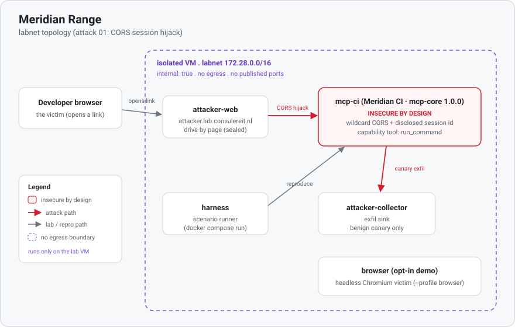

# Topology (modules 01, 02, and 03)

Real host identifiers are redacted to `<LAB_VM>` / `<ATTACKER_IP>` / `<VICTIM_IP>` - the live values live
only in the local operator notes, never in this repo.

<p align="center"></p>

```
VM  <LAB_VM>   (isolated test VM; default: only :22/tcp reachable)
└─ docker network  labnet  172.28.0.0/16   internal: true   (NO EGRESS, no published ports, NO DNS server by default)
   ├─ mcp-ci              172.28.0.11   "Meridian CI" (Java, mcp-core 1.0.0) - the CVE-2026-34237
   │                                    anchor (module 01, CORS). INSECURE BY DESIGN (exec tool).
   ├─ mcp-ci-fixed         172.28.0.12   same source, mcp-core 1.0.1 (patched) - opt-in mitigation
   │                                    comparison (--profile fixed; not started by plain `up`)
   ├─ mcp-vuln             172.28.0.10   buildbot-mcp (TypeScript SDK) - the VICTIM server for module 02
   │                                    (DNS rebinding, CVE-2025-66414 class)
   ├─ mcp-cross-client     172.28.0.20   TypeScript release approval service - module 03
   │                                    (cross-client elicitation routing, CVE-2026-25536)
   ├─ attacker-collector  172.28.0.66   exfil sink (benign)
   ├─ attacker-web        172.28.0.67   drive-by page - alias attacker.lab.consulereit.nl (SEALED; served by nginx)
   ├─ browser             172.28.0.68   headless Chromium victim (opt-in; --profile browser)
   └─ harness             172.28.0.100  MCP-client scenario runner (ephemeral; run --rm)
```

## Trust boundaries
- **`labnet` is `internal: true`** - by default no container can reach the internet and nothing outside
  the VM can reach a container. This is the primary containment for capability-bearing servers.
- **`mcp-ci` (module 01) and `mcp-vuln` (module 02) both carry `run_command`** (a shell surface). Both are
  intentionally vulnerable. In the **default** deployment no service defines `ports:`, there is **no DNS
  server**, and neither is reachable off the VM.
- **`mcp-cross-client` (module 03) has no command, file, or network tool.** It changes only a
  fictional in-memory release status. Its boundary is elicitation ownership across two separately
  authenticated sessions, and it remains sealed on the same internal network.

## Module 01 (CORS session hijack) - NO DNS required
Module 01 needs no DNS infrastructure. It runs three ways:

- **Headless (in-lab):** `./range run 01` addresses `mcp.lab.consulereit.nl` by labnet alias inside the sealed
  network.
- **Real browser, separate-VM IP mode (PRIMARY; no DNS):** attacker page + collector on one VM, victim
  `mcp-ci` on another. The page takes both targets as explicit query params (it never guesses):

  ```
  Attacker page: http://<ATTACKER_IP>:1337/lan.html?mcp=http://<VICTIM_IP>:8080&collector=http://<ATTACKER_IP>:9000/pwned
  Victim MCP:    http://<VICTIM_IP>:8080          -> ?mcp=
  Collector:     http://<ATTACKER_IP>:9000/pwned  -> ?collector=
  ```

- **Real browser, single-VM (`single-host` tier):** all three services on one VM; open with
  `http://<VM_IP>:1337/lan.html?samehost=1` (the only mode that falls back to the serving host).

- **Real browser, stable-DNS mode (ordinary FIXED records, NOT rebinding):** point plain A records at the
  same hosts and pass the targets as query params:

  ```
  attacker.lab.consulereit.nl     -> attacker page   (open  http://attacker.lab.consulereit.nl:1337/lan.html?mcp=http://mcp.lab.consulereit.nl:8080&collector=http://collector.lab.consulereit.nl:9000/pwned )
  mcp.lab.consulereit.nl        -> victim MCP
  collector.lab.consulereit.nl  -> attacker collector
  ```

For an external browser, module 01 **never** uses Docker-only names (`mcp.lab.consulereit.nl`,
`collector.lab.consulereit.nl`) - those resolve only inside the Docker network, and the page reports missing
config rather than defaulting to the serving host unless `?samehost=1` is set.

## Deployment tiers (the general model)

Every module declares which tiers it supports in its `module.yml` `topology:` block, and `./range` is
the only sanctioned way to bring one up. Exactly **one module** is deployed at a time.

| Tier | Hosts | Ports | Fragment | Notes |
|---|---|---|---|---|
| `sealed` | lab VM | none | (base + the module's own `compose.yml`) | mandatory for every module; the definition-of-done gate |
| `single-host` | lab VM | published | `modules/<NN-slug>/deploy/single-host.yml` | convenience; not every module can support it |
| `split-host` | attacker host + lab VM | published | `modules/<NN-slug>/deploy/{attacker,victim}.yml` | realistic, and safer: only non-capability-bearing services leave the VM |

The sealed deployment is two files: the base `engine/compose.yml` (network, shared telemetry volume,
attacker infra, harness) plus that module's own `modules/<NN-slug>/compose.yml` (its victim service),
which `./range up` merges. Every exposed tier lives one level deeper under `modules/<NN-slug>/deploy/`,
so no `docker compose up` can pick one up implicitly, and there is no compose file at the repo root at
all. Each exposed fragment uses the same non-internal bridge name `edge` (no fixed subnet), which is
unambiguous precisely because one module is up at a time. `./range check` fails the build if a `ports:`
key appears in the base file or in a module's sealed `compose.yml`.

## Exposed tiers for module 01

**`split-host` (recommended).** `modules/01-cors-session-hijack/deploy/attacker.yml` runs on the
**sanctioned attacker host** and `modules/01-cors-session-hijack/deploy/victim.yml` (an overlay of the
sealed files) runs on the **VM**. Only non-capability-bearing attacker infra leaves the VM; `mcp-ci`
(`run_command`) never does.

```
attacker host <ATTACKER_HOST_IP>          lab VM <LAB_VM>
  :1337 -> attacker-web  (lan.html)         :8080 -> mcp-ci  (capability-bearing; CORS target)
  :9000 -> attacker-collector (sink)
        └────── cross-origin fetch + exfil ──────┘
```

**`single-host` (convenience).**
`modules/01-cors-session-hijack/deploy/single-host.yml` (used only via `./range up`, never on a plain
`docker compose up`) adds the non-internal `edge` bridge and publishes three ports so a real browser on
the isolated lab LAN can complete module 01 end to end:

```
VM  <LAB_VM>  (isolated lab LAN)   ── tier: single-host ──
  :1337 -> attacker-web    (serve  http://<VM_IP>:1337/lan.html?samehost=1 )
  :8080 -> mcp-ci          (capability-bearing; the CORS hijack target)
  :9000 -> attacker-collector  (hijacked-canary sink)
```

Optionally front those ports with your **existing Traefik** (file/dynamic provider on your home host,
reaching each backend by `IP:port` - the same convention as the lab's Forgejo) to get clean HTTPS
subdomains. The routers are named for **roles**, so the same three names serve whichever module is up:

```
*.lab.consulereit.nl ─A─► Traefik (home host, TLS)   ── file-provider routers ──►  the lab LAN
   attacker.lab.consulereit.nl     ─►  http://<ATTACKER_HOST>:1337   attacker-web        (router mr-hacker)
   mcp.lab.consulereit.nl        ─►  http://<LAB_VM>:8080          mcp-ci              (router mr-mcp)
   collector.lab.consulereit.nl  ─►  http://<ATTACKER_HOST>:9000   attacker-collector  (router mr-collector)
   (single-host tier: <ATTACKER_HOST> is the VM itself)
```

Generate the router config with `./range traefik 01` (knobs in `.env`); see [`traefik.md`](./traefik.md).
A wildcard `*.lab.consulereit.nl` record already covers every role name, so adding a module adds no DNS
record. This is opt-in and widens reach beyond the lab LAN, so keep the Traefik routes off the internet and
tear down after.

## Module 02's `split-host` tier (TWO VMs) - the ONLY place DNS lives
Module 02's live rebind is `split-host` **only**, and it is the only place DNS-rebinding infrastructure
runs. It uses your **existing** lab Technitium and publishes the attacker page and the victim MCP on the
**same port at two different lab IPs**, so the single name `rebind.lab.consulereit.nl` can flip between
them (short TTL) without any host-IP port collision. That shared port is exactly why this module has **no
`single-host` tier**: one host cannot bind it twice.

```
(isolated lab LAN)   rebind.lab.consulereit.nl : PORT   (same host+port throughout; only the IP changes)

  <ATTACKER_IP>  ── modules/02-dns-rebind/deploy/attacker.yml ──  rebind-web  (attacker page - INITIAL answer)
                                                                  attacker-collector (canary sink)
                                                                  [rebind-dns only with --profile bundled-dns]
  <VICTIM_IP>    ── modules/02-dns-rebind/deploy/victim.yml   ──  mcp-vuln    (victim MCP  - FINAL answer)
```

This tier uses **direct port publishing + a DNS A record to the host** (the same `*.lab.consulereit.nl`
convention the lab already uses, e.g. the forgejo service); no Traefik labels are guessed. The module
declares `topology.traefik: false` and `./range traefik 02` refuses, because a rebind must flip in the
DNS **answer**, not in a proxy backend. The base file and module 01 remain DNS-free. Full operations
(record, TTL, initial/final answers, browser-resolver notes, the flip, restore, teardown) are in
[`../modules/02-dns-rebind/README.md`](../modules/02-dns-rebind/README.md). All exposed tiers are for an
isolated lab LAN only and must be torn down afterwards.

- **Attacker infra is lab-scoped.** `attacker.lab.consulereit.nl`, `rebind.lab.consulereit.nl` and the
  rest of the `*.lab.consulereit.nl` records resolve only on the isolated lab LAN via the lab's own
  DNS, and never from the internet. Inside the sealed tier they are labnet aliases on an
  `internal: true` network, so they resolve to the range's own containers and reach nothing else. The
  collector only ever stores benign canary output.

## Module 03 is sealed only

Module 03 needs neither attacker infrastructure nor a published endpoint. Both parties are legitimate
clients of one service, and the failed boundary is inside the application's protocol-object lifecycle.
The ephemeral harness creates Alice and Bob as separate official SDK clients inside `labnet`; each uses
its own fabricated bearer token and receives its own MCP session. Keeping the scenario sealed removes
DNS, browsers, reverse proxies, and outside timing from the result.

## Names & aliases
Scenarios address services by **labnet alias**, not by IP, so the static IPs above are for
reference/ordering only. Each module's `scenario.ts` gets those aliases from its own committed
`modules/<NN-slug>/lab.env`: module 01 addresses `mcp.lab.consulereit.nl`, and module 02 addresses
`mcp.lab.consulereit.nl` while presenting a forged `Host: rebind.lab.consulereit.nl` to model the
post-rebind request. Module 03 uses `mcp.lab.consulereit.nl` with two public, fabricated bearer-token
fixtures.

## Coexistence note
The compose project reuses the `172.28.0.0/16` subnet and fixed container names. If another MCP lab
using the same subnet/names is already running on the VM, they cannot run simultaneously - stop the
other stack first, or renumber this one.
