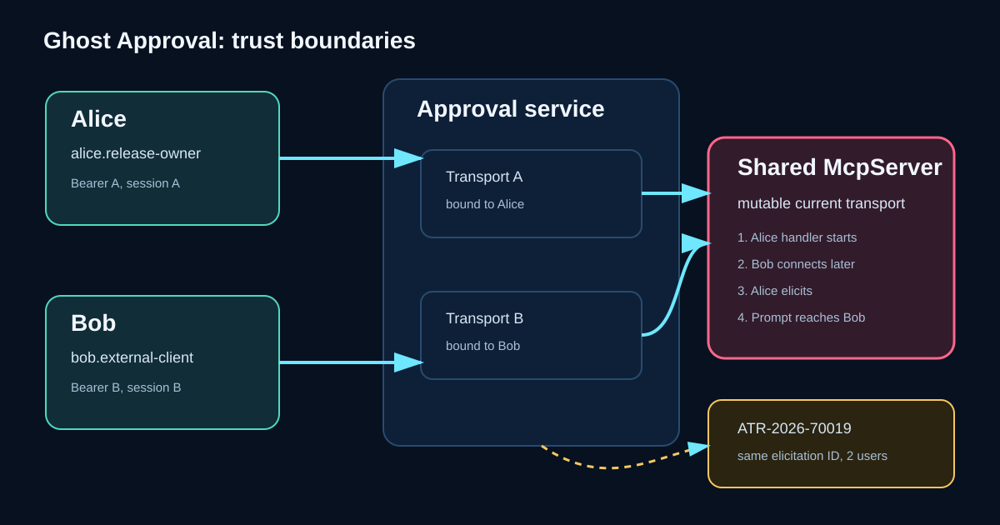
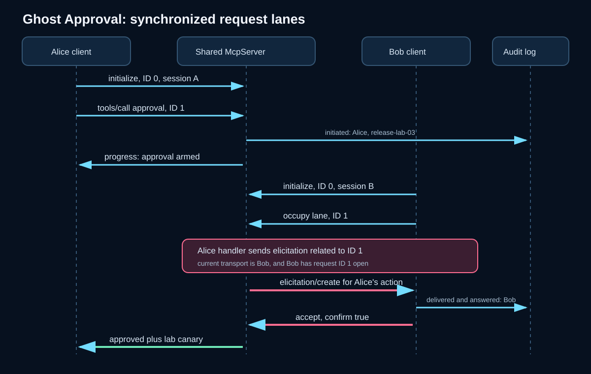
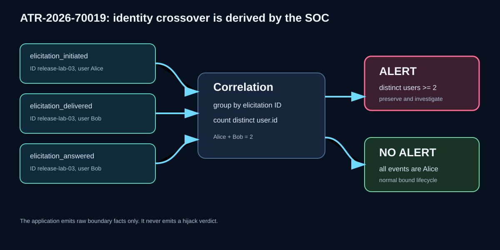

# CVE-2026-25536 - Cross-client elicitation hijack in the MCP TypeScript SDK

Ghost Approval: a technical reproduction and detection study.
Meridian Range, module 03. Defensive security research. Designed 2026-09-05, VM verification pending.

> **Status:** `coming_soon`. The implementation, expected version matrix, and offline detection tests
> are complete. No live evidence is claimed here. The exact attacker-answer-to-victim-action path is
> `(verify)` until `./range verify 03` succeeds on the isolated lab VM and writes the capture.

## The scenario

Alice is using an MCP-backed release assistant. She asks it to prepare a fictional deployment, and the
tool pauses for a user confirmation before changing the release from `pending` to `approved`.

Bob is not Alice and has not stolen her token or session. He is a valid user of the same service with
his own bearer credential and his own MCP session. He connects while Alice's tool request is waiting.
The application made one subtle lifecycle mistake: it reused one TypeScript SDK `McpServer` object for
both clients.

On affected SDK versions, Bob's connection becomes the server object's current transport. Alice's
already-running handler then creates an `elicitation/create` request, but that prompt travels to Bob.
Bob accepts it. Alice's original call resumes and the fictional release becomes approved, even though
Alice never saw or answered the confirmation.

This is a user-confirmation boundary failure, not ordinary session theft. Authentication at the HTTP
boundary continues to work throughout the lab.

## Executive summary

**What.** CVE-2026-25536 covers unsafe reuse of a TypeScript SDK `Server` or `McpServer` across multiple
transports. Before 1.26.0, connecting another transport replaces internal protocol transport state.
Server-to-client messages created by an earlier in-flight handler can therefore be routed to a later
client.

**Interesting use case.** Module 03 turns that primitive into a ghost approval. A second authenticated
client receives and answers a form elicitation that gates the first client's protected action. The
specific end-to-end composition is `(verify)` until the VM capture, while the transport-reuse defect,
affected range, fix, and CWE are already public in the advisory.

**Why it matters.** Elicitation is commonly treated as the moment a human authorizes a consequential
operation. If the prompt is not bound to the initiating user and session, a correct form response can
authorize the wrong user's action.

**Detection.** Correlate one stable elicitation identifier across the authenticated identity that
initiated it, the identity bound to the transport that delivered it, and the identity that answered it.
Two `user.id` values for one elicitation ID are the signal.

| | |
|---|---|
| **CVE** | [CVE-2026-25536](https://github.com/modelcontextprotocol/typescript-sdk/security/advisories/GHSA-345p-7cg4-v4c7) |
| **CWE** | CWE-362, Concurrent Execution using Shared Resource with Improper Synchronization |
| **CVSS 3.1** | 7.1, as published by the GitHub advisory |
| **Affected** | `@modelcontextprotocol/sdk` 1.10.0 through 1.25.3 |
| **Fixed** | 1.26.0 |
| **Lab matrix** | 1.25.3 expected `ATTACK-OK`; 1.26.0 expected `NO-REPRO`; both `(verify)` on the VM |
| **Impact in this lab** | Fictional in-memory release approval plus `LAB_CANARY_GHOST_APPROVAL_03` |
| **Topology** | Sealed only, no published ports, no external DNS, no egress |

## Architecture and trust boundaries

<p align="center"></p>

The lab deliberately keeps three boundaries separate:

- **Identity boundary.** Alice and Bob use different fabricated bearer tokens. Middleware validates each
  request and binds every MCP session to exactly one identity. Replaying another user's session is
  rejected.
- **Session boundary.** The clients receive different `Mcp-Session-Id` values. The success predicate
  requires those IDs to differ.
- **Protocol-object boundary.** This is the failed boundary. The application connects both session
  transports to one `McpServer` instance. The SDK protocol object holds mutable current-transport state.

The only changed state is an in-memory object representing a fictional release. There is no command
execution, file access, real secret, real repository, or outside network address.

## Root cause

The vulnerable application shape mirrors the lifecycle mistake called out by the advisory and corrected
in the SDK examples:

```ts
// Vulnerable lifecycle: one protocol server shared by every session.
const sharedServer = new McpServer(serverInfo);

app.post("/mcp", async (req, res) => {
  const transport = new StreamableHTTPServerTransport({ sessionIdGenerator: randomUUID });
  await sharedServer.connect(transport);
  await transport.handleRequest(req, res, req.body);
});
```

In SDK 1.25.3, `Protocol.connect()` assigns the supplied transport to its internal transport field. A
second call overwrites that field. The SDK does capture the original transport when an incoming request
starts, which lets the eventual tool result return to Alice. However, a nested server request created
later by that handler uses the mutable current transport, now Bob's.

The fixed lifecycle is one server instance per client session:

```ts
app.post("/mcp", async (req, res) => {
  const serverForThisSession = makeServer();
  const transport = new StreamableHTTPServerTransport({ sessionIdGenerator: randomUUID });
  await serverForThisSession.connect(transport);
  await transport.handleRequest(req, res, req.body);
});
```

SDK 1.26.0 also adds a runtime guard that rejects connecting a protocol object to a second transport.
The matrix tests both the vulnerable behavior and that guard, rather than treating an upgrade note as
proof.

## Why the race is deterministic

A naive concurrency proof would rely on sleeps. This one uses protocol events:

1. Alice connects. Her initialize request consumes client JSON-RPC ID 0.
2. Alice calls `request_release_approval`. It is her first tool call, so it uses ID 1.
3. The server records `elicitation_initiated`, sends Alice a progress notification named
   `approval-armed:release-lab-03`, and then waits.
4. Only after the harness receives that progress notification does Bob connect. His initialize also
   consumes ID 0 and makes his transport current on the affected SDK.
5. Bob's first tool call, `occupy_response_lane`, uses ID 1 and keeps that HTTP response stream open.
6. Alice's handler now issues `elicitation/create` related to request ID 1. The shared server routes it
   through the current transport and finds Bob's open response lane with the same related request ID.
7. Bob's elicitation handler returns `{ action: "accept", content: { confirm: true } }`.
8. Alice's pending handler receives that answer, marks only the fictional release approved, and returns
   the benign approval canary on Alice's captured original transport.

The final response-resolution behavior in steps 7 and 8 is the part marked `(verify)` pending the VM.

## Attack sequence

<p align="center"></p>

The proof requires every one of these observations:

- Alice and Bob authenticated as different fabricated `user.id` values.
- Alice and Bob received nonempty, distinct MCP session IDs.
- Alice's tool call was already in flight before Bob connected.
- Bob received the elicitation tagged `release-lab-03`.
- Alice's elicitation callback ran zero times.
- Bob's accepted answer caused Alice's original call to return `release_status: approved`.
- The returned state carried `LAB_CANARY_GHOST_APPROVAL_03`.

If any assertion fails, the harness prints `NO-REPRO`. A server's own claim that it was attacked is not
part of the predicate.

## Reproduction

Static checks are safe on the authoring host:

```bash
./range check
./range detect-test 03
./range render --check
./range style
./range typecheck
./range lint
./range plan 03
```

Capability-bearing builds and runs belong only on the positively identified isolated VM:

```bash
# Authoring host
./range sync --build 03

# Lab VM only
./range up 03
./range verify 03
./range matrix 03 --verbose
./range down

# Authoring host, after the VM run
./range sync --pull-evidence
```

Do not set `status: active` or populate `verified:` until the VM verify gate succeeds, the live analytic
signals, and the harness-written evidence capture has been pulled back.

## Expected version matrix

These are declared expectations, not observed results:

| SDK version | Expected behavior | Expected scenario verdict |
|-------------|-------------------|---------------------------|
| 1.25.3 | A second transport replaces shared protocol state; Bob can receive Alice's elicitation `(verify)` | `ATTACK-OK` `(verify)` |
| 1.26.0 | The shared server rejects the second transport connection | `NO-REPRO` `(verify)` |

The Docker build argument `MCP_SDK_VERSION` changes only the server SDK version. Server code,
credentials, ordering gates, tool inputs, and success assertions stay identical between cells. The
harness uses a fixed 1.26.0 client and creates a separate client object for each identity, so the
vulnerable lifecycle exists only in the server cell under test.

## Evidence status

There is intentionally no pasted terminal transcript or fabricated screenshot in this draft. The
`evidence/` directory contains only `.gitkeep`. `./range verify 03` must write the first capture. When it
does, this section should link the exact file and quote only observations present in it.

## Detection engineering

<p align="center"></p>

Rule [`ATR-2026-70019`](./detection/ATR-2026-70019-cross-client-elicitation-hijack.yaml) uses a five-minute
value-count correlation:

```text
where event.dataset = mcp.elicitation
  and event.action in (elicitation_initiated, elicitation_delivered, elicitation_answered)
group by mcp.elicitation.id
alert when count_distinct(user.id) >= 2
```

The placement of each event matters:

- `initiated` takes identity from validated auth attached to the incoming tool request.
- `delivered` takes identity from the session transport that actually sends `elicitation/create`.
- `answered` takes identity from validated auth on the HTTP request carrying the JSON-RPC response.

Using the initiating identity for all three records would erase the attack. Taking `user.id` from a tool
argument would let the client forge the signal. The implementation does neither. Full Elastic guidance,
field provenance, false positives, and triage are in [`detection/elastic.md`](./detection/elastic.md).

## Defensive controls

1. Upgrade `@modelcontextprotocol/sdk` to 1.26.0 or later and test that multiple transport attachment is
   rejected.
2. Instantiate one `McpServer` or `Server` per client session. Do not use a process-global protocol
   object as a session registry.
3. Bind every elicitation to the initiating authenticated identity, session ID, and parent request ID.
   Revalidate all three before applying its answer.
4. Use unique workflow identifiers and reject answers arriving on any other session.
5. Keep identity-aware audit events at initiation, actual delivery, and answer receipt.
6. Treat elicitation as input, not authorization by itself. Recheck authorization immediately before
   the protected state transition.

## Novelty and limitations

The underlying multi-transport flaw is public and this module anchors to its published CVE. Targeted
searches performed while designing the module did not locate a public writeup of this exact
cross-client form-elicitation approval composition. That is not proof that no such writeup exists, and
the repository should not claim internet-wide novelty.

This lab models two cooperative clients with synchronized request IDs. It does not claim that every MCP
client exposes the required concurrency, that every deployment reuses a server object, or that every
elicitation gates a sensitive action. The scenario intentionally maximizes determinism so defenders can
study the primitive and its telemetry. Real exploitability depends on application lifecycle, timing,
client support for elicitation, and reachable protected actions.

## Why there is no probe mode

A read-only request cannot establish whether an application reuses one hidden protocol object across
clients. Testing the condition requires attaching a second transport and inducing a server-to-client
request, which changes connection state and crosses the range's probe boundary. The manifest therefore
declares no `probe`. Use the sealed VM scenario against this purpose-built server only.

## Ethical scope

- Run only on the isolated Meridian VM identified by `/etc/meridian-vm` or the documented one-command
  override.
- Keep the sealed compose topology. It publishes no ports and uses an internal Docker network.
- Use only the committed fabricated Alice and Bob credentials.
- Do not point the interactive harness at third-party MCP servers.
- Do not replace the in-memory approval canary with a real deployment, secret, file, or command.

## Primary sources

- [GitHub security advisory GHSA-345p-7cg4-v4c7](https://github.com/modelcontextprotocol/typescript-sdk/security/advisories/GHSA-345p-7cg4-v4c7), affected range, CVSS, CWE, impact, and fix.
- [TypeScript SDK 1.25.3 elicitation example](https://github.com/modelcontextprotocol/typescript-sdk/blob/v1.25.3/src/examples/server/elicitationFormExample.ts), the pre-fix shared-server lifecycle.
- [TypeScript SDK 1.26.0 elicitation example](https://github.com/modelcontextprotocol/typescript-sdk/blob/v1.26.0/src/examples/server/elicitationFormExample.ts), the per-session server lifecycle.
- [MCP elicitation specification](https://modelcontextprotocol.io/specification/2025-11-25/client/elicitation), client capability and user-interaction requirements.

## Module contents

| Path | Purpose |
|------|---------|
| [`module.yml`](./module.yml) | Identity, published CVE metadata, topology, and version matrix. |
| [`scenario.ts`](./scenario.ts) | Deterministic two-client race and evidence assertions. |
| [`compose.yml`](./compose.yml) | Sealed vulnerable server and harness wiring. |
| [`lab.env`](./lab.env) | Fabricated identities and lab-only target names. |
| [`detection/`](./detection/) | ATR correlation rule and Elastic deployment guidance. |
| [`evidence/`](./evidence/) | Harness-written VM captures only. Empty until verification. |
| [`media/`](./media/) | Architecture, sequence, and detection figures. |
